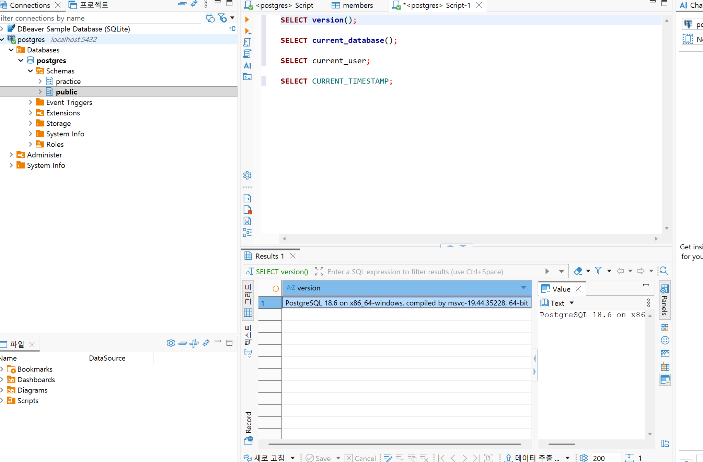
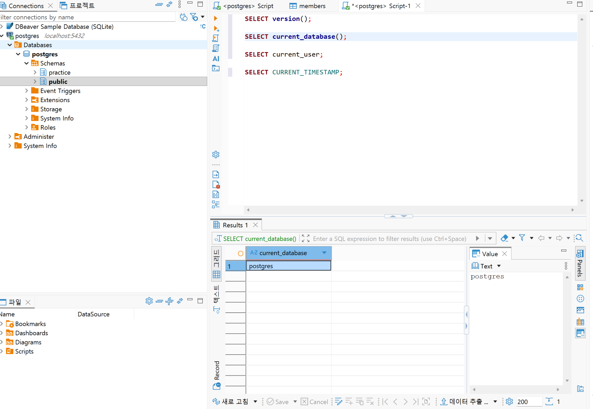
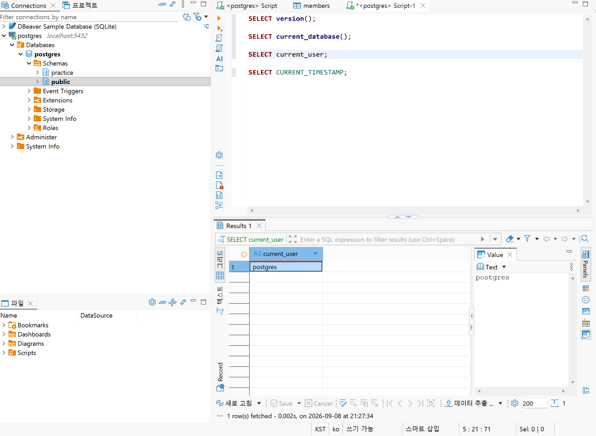
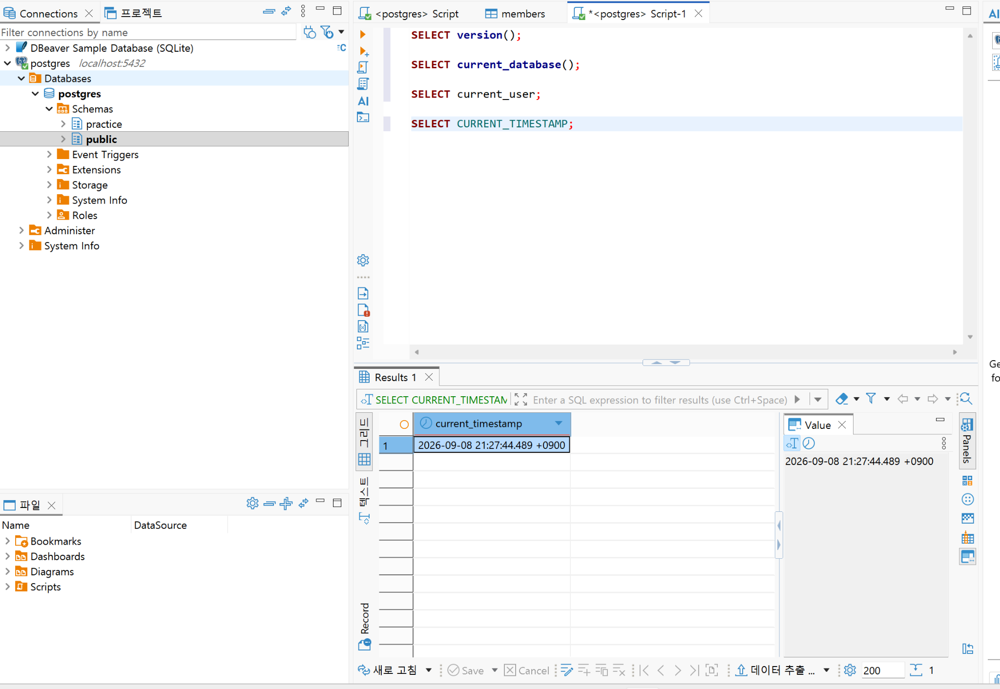
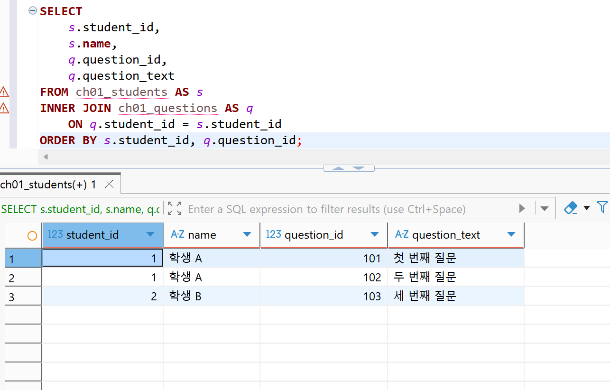
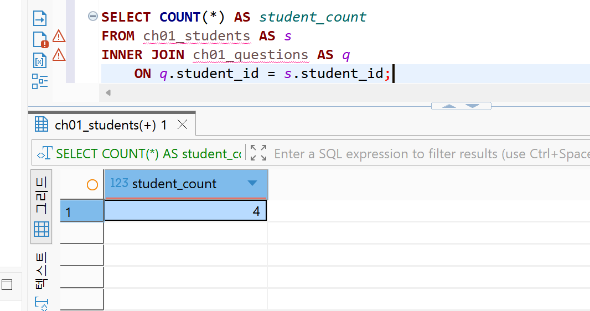
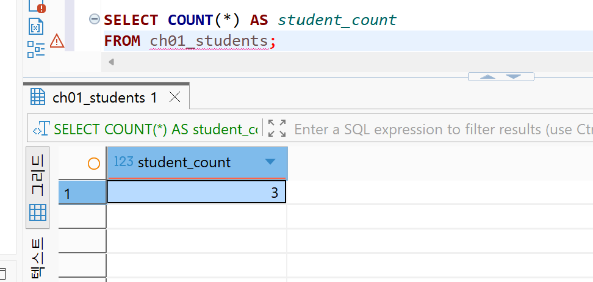
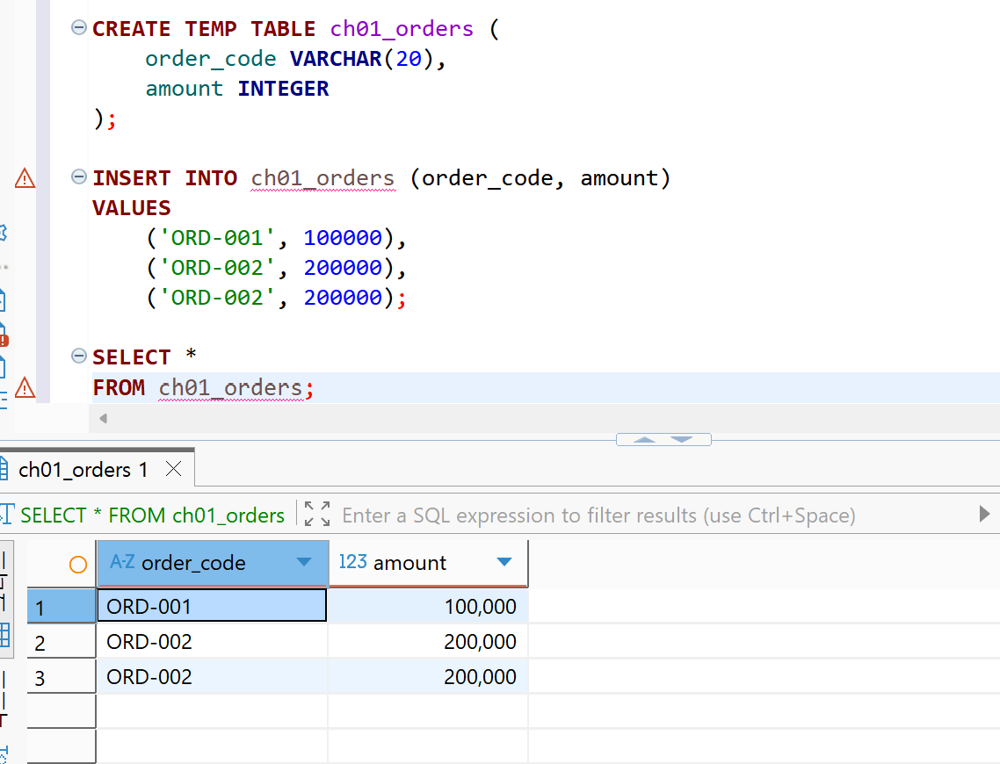
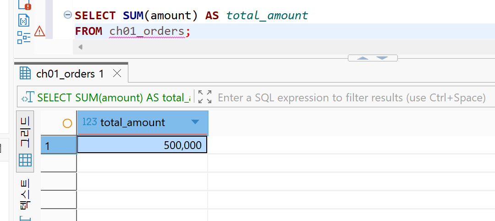
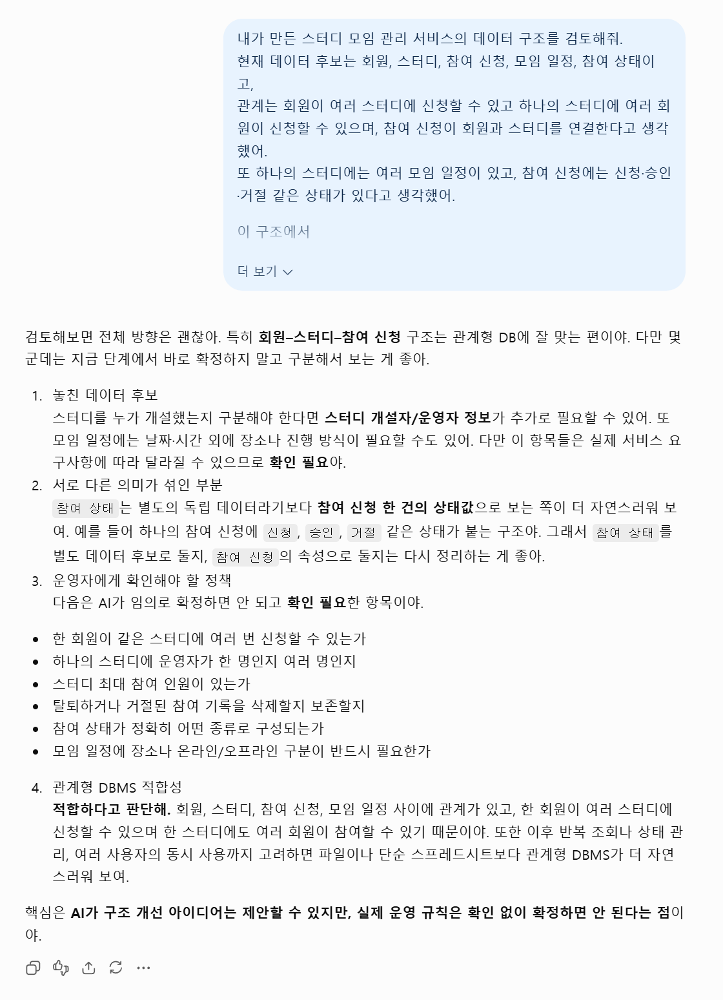

# Chapter 01 확장 실습 답안 템플릿

> **과제:** AI 시대에 데이터베이스를 왜 배워야 하는가  
> **사용 방법:** 이 파일을 내려받아 **본인의 GitHub 저장소**에 `chapter01_answer.md`라는 이름으로 저장한 뒤 답안을 작성합니다.  
> **제출 방법:** LMS에는 파일을 업로드하지 않고, **본인 GitHub 저장소의 `chapter01_answer.md` 파일 URL**을 제출합니다.

---

## 0. 학생 정보

| 항목 | 작성 내용 |
| --- | --- |
| 학번 | 2026-51301 |
| 이름 | 양규범 |
| GitHub 계정 | yangguebeom |
| 과제 작성일 | 2026-09-08 |
| 사용한 AI 도구 | ChatGPT |

> 실제 비밀번호, API Key, 전체 DB 접속 URL, 개인정보는 이 파일이나 캡처 화면에 기록하지 않습니다.

---

# 1. PostgreSQL 실행 환경 확인

## 1-1. 실행한 SQL

```sql
SELECT version();
SELECT current_database();
SELECT current_user;
SELECT CURRENT_TIMESTAMP;
```

## 1-2. 실행 결과 기록

```text
PostgreSQL 버전:PostgreSQL 18.6 on x86_64-windows, compiled by msvc-19.44.35228, 64-bit
현재 데이터베이스:postgres
현재 사용자:postgres
현재 시각:2026-09-08 21:27:44.489 +0900
```

## 1-3. 내가 확인한 내용

1. SQL을 작성하는 프로그램과 PostgreSQL은 같은 프로그램인가요?

```text
나의 답:같은 프로그램이 아니다. DBeaver는 SQL을 작성하고 실행하는 클라이언트 도구이고, PostgreSQL은 실제로 데이터를 저장하고 SQL 명령을 처리하는 DBMS이다.
```

2. `current_database()` 결과는 무엇을 의미하나요?

```text
나의 답:현재 연결된 세션이 어떤 데이터베이스에 접속되어 있는지를 의미한다. 이번 실습에서는 postgres 데이터베이스에 연결되어 있음을 확인했다.
```

3. SQL이 실행되었다는 사실만으로 데이터 내용도 올바르다고 할 수 있나요?

```text
나의 답:그렇지 않다. SQL 문법이 올바르고 정상적으로 실행되더라도, 저장된 데이터 자체가 잘못되어 있거나 조건을 잘못 설정했다면 결과 역시 잘못될 수 있다.
```

## 1-4. 증거 화면

아래 경로에 캡처 이미지를 저장하는 것을 권장합니다.

```text
assignments/chapter01/images/step01_version.png
assignments/chapter01/images/step01_database.png
assignments/chapter01/images/step01_user.png
assignments/chapter01/images/step01_timestamp.png
```

이미지를 저장했다면 아래 링크의 파일명을 실제 파일명에 맞게 수정합니다.











---

# 2. Chapter 01 핵심 내용 복습

교재 문장을 그대로 복사하지 말고 자신의 말로 작성합니다.

| 본문의 핵심 | 나의 설명 |
| --- | --- |
| AI가 SQL을 만들어도 DB를 배워야 한다 | AI가 SQL 코드를 작성해 줄 수는 있지만, 결과가 맞는지 판단하고 오류를 수정하려면 데이터베이스의 기본 개념과 SQL을 이해해야 한다. |
| 데이터 구조가 중요하다 | 같은 데이터라도 테이블과 컬럼을 어떻게 구성하느냐에 따라 저장과 검색의 효율, 결과의 정확성이 달라질 수 있다. |
| SQL 결과를 검증해야 한다 | SQL이 오류 없이 실행되었다고 해서 결과가 항상 올바른 것은 아니므로, 조건과 데이터 내용을 확인하며 결과를 검증해야 한다. |
| 데이터 품질이 AI 답변 품질에 영향을 준다 | 잘못되거나 누락된 데이터가 입력되면 AI도 부정확한 판단을 할 수 있기 때문에 데이터의 정확성과 품질 관리가 중요하다. |
| 저장 방식은 데이터 양만 보고 선택하지 않는다 | 데이터의 양뿐만 아니라 구조, 검색 방법, 수정 빈도, 여러 사용자의 동시 사용 여부 등을 고려하여 파일, 스프레드시트, DBMS 중 적절한 방식을 선택해야 한다. |

## 가장 중요하다고 생각한 한 문장

```text
데이터베이스를 이해해야 AI가 만든 SQL과 그 결과가 올바른지 스스로 판단할 수 있다고 생각한다.
```

---

# 3. 실행 성공과 결과 정확성의 차이

## 3-1. SQL 실행 전 예상

학생 A는 질문 2개, 학생 B는 질문 1개, 학생 C는 질문이 없습니다.

```text
전체 학생 수: ____3__ 명
전체 질문 수: __3____ 개
질문이 있는 학생 수: ___2___ 명
질문이 없는 학생 수: ___1___ 명
```

## 3-2. 임시 테이블 생성 및 데이터 입력 완료 확인

- [x] `ch01_students` 생성
- [x] `ch01_questions` 생성
- [x] 학생 3명 입력
- [x] 질문 3건 입력
- [x] 두 테이블의 데이터를 직접 조회

## 3-3. 잘못된 학생 수 SQL 실행 결과

실행한 SQL:

```sql
SELECT COUNT(*) AS student_count
FROM ch01_students AS s
INNER JOIN ch01_questions AS q
    ON q.student_id = s.student_id;
```

실행 결과:

```text
student_count: 3
```

## 3-4. JOIN 상세 결과 관찰

```text
학생 A가 나타난 행 수:2
학생 B가 나타난 행 수:1
학생 C가 나타난 행 수:0
```

다음 질문에 답합니다.

### Q1. 학생 C가 왜 결과에서 사라졌나요?

```text
INNER JOIN은 두 테이블에서 조건이 일치하는 행만 보여주기 때문에, 질문이 없는 학생 C는 연결되는 행이 없어 결과에서 제외되었다.
```

### Q2. 학생 A가 왜 여러 행으로 나타났나요?

```text
학생 A에게 연결된 질문이 2개이므로 질문 하나마다 JOIN 결과 행이 하나씩 생성되어 2행으로 나타났다.
```

### Q3. 위 `COUNT(*)`가 실제로 세고 있었던 것은 무엇인가요?

```text
실제 학생 수가 아니라 INNER JOIN 이후 생성된 결과 행의 수를 세고 있었다.
```

### Q4. 결과 숫자가 우연히 실제 학생 수와 같아도 바로 믿으면 안 되는 이유는 무엇인가요?

```text
현재는 JOIN 결과 행 수와 실제 학생 수가 우연히 같지만, 데이터가 바뀌면 서로 다른 값이 될 수 있기 때문이다.
```

## 3-5. 질문 한 건을 추가한 뒤 다시 실행

추가한 데이터:

```text
학생 A에게 질문 1건을 추가하였다.
```

다시 실행한 결과:

```text
AI SQL 결과:4
실제 학생 수:3
```

### 결과 해석

```text
데이터가 바뀐 뒤 무엇이 달라졌는지:학생 A의 질문이 하나 증가하면서 INNER JOIN 결과 행의 수가 3개에서 4개로 증가했고, COUNT(*) 결과도 4로 증가하였다.

실제 학생 수는 왜 그대로인지:질문 데이터만 추가했을 뿐 학생 테이블에는 새로운 학생을 추가하지 않았기 때문에 실제 학생 수는 여전히 3명이다.

이 실험을 통해 알게 된 점:SQL이 정상적으로 실행되더라도 결과 숫자가 내가 의도한 대상을 세고 있는지는 반드시 따로 확인해야 한다는 것을 알게 되었다.
```

## 3-6. 학생 테이블을 직접 센 결과

```sql
SELECT COUNT(*) AS student_count
FROM ch01_students;
```

결과:

```text
student_count: 3
```

### 두 SQL의 차이를 내 말로 설명

```text
첫 번째 SQL은 INNER JOIN 이후 생성된 결과 행의 수를 세고 있었다.

두 번째 SQL은 ch01_students 테이블에 저장된 학생 수를 직접 세고 있었다.

따라서 SQL을 검토할 때는 문법보다 먼저
어떤 데이터를 대상으로 세고 있는지를 확인해야 한다.
```

## 3-7. 증거 화면

권장 경로:

```text
assignments/chapter01/images/step03_join_detail.png
assignments/chapter01/images/step03_wrong_count.png
assignments/chapter01/images/step03_correct_count.png
```






---

# 4. 잘못된 데이터가 결과를 바꾸는 과정

## 4-1. 주문 데이터 확인

다음 데이터를 입력한 뒤 실제 결과를 확인합니다.

```text
ORD-001, 100000
ORD-002, 200000
ORD-002, 200000
```

## 4-2. 실행 전 예상

업무적으로 주문이 `ORD-001`, `ORD-002` 두 건이고 `order_code`가 주문을 고유하게 구분한다고 **가정할 경우** 예상 합계:

```text
300000원
```

> 위 가정 자체가 실제 업무 규칙인지 확인해야 한다는 점도 기억합니다.

## 4-3. SQL 합계

```sql
SELECT SUM(amount) AS total_amount
FROM ch01_orders;
```

실제 결과:

```text
500000 원
```

## 4-4. 결과 해석

### `SUM` 문법 자체가 잘못된 것인가요?

```text
아니다. SUM 함수와 SQL 문법 자체는 올바르게 실행되었다. 현재 테이블에 저장된 세 행의 amount 값을 정확하게 모두 더해서 500000원이 나온 것이다.
```

### 결과 차이의 원인은 무엇인가요?

```text
ORD-002 데이터가 두 번 입력되어 중복된 금액까지 합계에 포함되었기 때문이다.
```

### SQL이 정확하게 실행되어도 업무 숫자가 잘못될 수 있는 이유를 설명하세요.

```text
SQL은 저장된 데이터를 기준으로 계산하므로 데이터 자체에 중복이나 오류가 있으면 문법이 정확해도 업무적으로 잘못된 결과가 나올 수 있다. 따라서 SQL 결과뿐 아니라 데이터 품질과 실제 업무 규칙도 함께 확인해야 한다.
```

## 4-5. AI에게 같은 데이터를 분석시킨 결과

AI가 계산한 합계:

```text
500000원
```

AI가 중복 가능성을 언급했나요?

```text
예. ORD-002가 동일한 주문 코드로 두 번 존재하므로 중복 입력일 가능성이 있다고 판단했다.
```

AI가 `ORD-002` 두 행이 실제 두 주문인지 중복 입력인지 스스로 확정할 수 있나요? 이유도 적으세요.

```text
확정할 수 없다. order_code가 반드시 주문 한 건을 고유하게 식별하는지, 같은 주문 코드가 여러 행으로 존재할 수 있는지에 대한 실제 업무 규칙을 알 수 없기 때문이다.
```

추가로 확인해야 할 업무 규칙:

```text
1.order_code가 주문 한 건을 고유하게 식별하는 값인지 확인한다.
2.동일한 order_code가 여러 행으로 저장될 수 있는 경우가 있는지 확인한다.
3.중복 데이터가 발견되었을 때 어떤 기준으로 제거하거나 처리해야 하는지 확인한다.
```

내가 최종적으로 내린 판단:

```text
현재 데이터만 기준으로 보면 SQL 합계 500000원은 저장된 데이터를 정확히 계산한 결과이다. 그러나 order_code가 주문을 고유하게 구분한다는 업무 규칙이 맞다면 ORD-002는 중복 입력으로 볼 수 있으므로 실제 주문 합계는 300000원이라고 판단한다.
```

## 4-6. 증거 화면

권장 경로:

```text
assignments/chapter01/images/step04_orders.png
assignments/chapter01/images/step04_duplicate_result.png
```





---

# 5. 파일·스프레드시트·DBMS 선택 연습

각 사례에 대해 **AI에게 묻기 전에 먼저 본인의 판단을 작성**합니다.

## 사례 A. 개인 독서 기록

```text
나의 선택:파일
선택 이유:한 사람만 사용하고 한 달에 추가되는 데이터도 많지 않으며, 책 제목과 읽은 날짜, 짧은 메모 정도만 기록하면 되기 때문에 간단한 파일로도 충분히 관리할 수 있다고 판단했습니다.
어떤 조건이 추가되면 다른 방식으로 바꿀 것인지:책의 수가 크게 늘어나거나 장르, 저자, 평점 등 여러 항목을 기준으로 반복 조회와 집계를 자주 해야 한다면 스프레드시트나 DBMS로 바꿀 것 같습니다.
```

## 사례 B. 동아리 행사 신청 명단

```text
나의 선택:스프레드시트
선택 이유:운영진 2~3명이 함께 수정해야 하고 이름, 연락처, 참석 여부처럼 표 형태의 데이터를 관리하며, 행사 종료 후 참석률 같은 간단한 집계를 해야 하므로 스프레드시트가 적합하다고 판단했습니다.
어떤 조건이 추가되면 다른 방식으로 바꿀 것인지:행사 종류와 신청자가 크게 늘어나고 여러 행사를 장기간 관리하거나, 권한 구분과 변경 이력 관리가 중요해진다면 DBMS로 바꿀 것 같습니다.
```

## 사례 C. 온라인 강의 서비스

```text
나의 선택:DBMS
선택 이유:학생과 강의 사이에 다대다 관계가 있고, 신청 상태와 신청 당시 금액을 저장해야 하며, 여러 사용자가 동시에 사용한다. 또한 월별 신청 건수처럼 반복 조회와 집계가 필요하고 권한 관리와 백업·복구도 중요하므로 DBMS가 가장 적합하다고 판단했습니다.
어떤 조건이 추가되면 다른 방식으로 바꿀 것인지:사용자가 한 명뿐이고 강의와 신청 데이터가 매우 적으며 관계나 권한 관리가 필요 없는 단순한 기록 수준이라면 파일이나 스프레드시트로 단순화할 수 있을 것 같습니다.
```

## 판단 기준 체크

- [x] 데이터 증가
- [x] 여러 사용자의 동시 수정
- [x] 데이터 사이의 관계
- [x] 반복 조회와 집계
- [x] 정확성·일관성
- [x] 변경 이력
- [x] 권한 구분
- [x] 백업·복구
- [x] 웹·앱에서 지속 사용

### 데이터가 적으면 무조건 스프레드시트를 사용해야 하나요?

```text
나의 답:아닙니다. 데이터가 적더라도 여러 사용자가 동시에 수정하거나 데이터 사이의 관계가 복잡하고, 정확성·권한·백업·복구가 중요하다면 DBMS가 더 적합할 수 있습니다. 따라서 저장 방식은 데이터 양만으로 결정하면 안 됩니다.
```

---

# 6. 나만의 서비스 데이터 구조 초안

> 이 내용은 이후 Chapter에서 계속 확장할 수 있으므로 신중하게 작성합니다.

## 6-1. 서비스 정의

```text
서비스 이름:스터디 모임 관리 서비스

이 서비스는
사용자가 스터디 모임을 만들고 다른 사용자가 원하는 스터디에 참여 신청하여 모임 활동을 관리하기 위한 서비스이다.
```

## 6-2. 관리할 데이터 후보

```text
1.회원
2.스터디
3.참여 신청
4.모임 일정
5.참여 상태
```

## 6-3. 한 행의 의미

| 데이터 후보 | 한 행의 의미 |
| --- | --- |
| 회원 | 서비스에 가입한 회원 한 명 |
| 스터디 | 개설된 스터디 모임 한 개 |
| 참여 신청 | 한 회원이 특정 스터디에 참여를 신청한 사건 한 건 |
| 모임 일정 | 특정 스터디에서 진행하는 일정 한 건 |
| 참여 상태 | 회원의 스터디 참여 상태 한 건 |

## 6-4. 관계를 자연어로 설명

```text
1.한 회원은 여러 스터디에 참여 신청을 할 수 있습니다.
2.하나의 스터디에는 여러 회원이 참여할 수 있습니다.
3.하나의 참여 신청은 한 회원과 한 스터디를 연결합니다.
4. 하나의 스터디에는 여러 모임 일정이 존재할 수 있습니다.
5. 각 참여 신청에는 신청, 승인, 거절 등의 참여 상태가 존재할 수 있습니다.
```

## 6-5. 아직 결정하지 않은 정책

```text
Q1.한 회원이 같은 스터디에 여러 번 참여 신청할 수 있는가?
Q2.스터디의 최대 참여 인원을 제한할 것인가?
Q3.이미 승인된 회원이 스터디에서 탈퇴한 경우 참여 기록을 삭제할 것인가, 이력으로 남길 것인가?
```

> 확정되지 않은 정책을 AI가 임의로 결정한 경우 그대로 받아들이지 않습니다.

---

# 7. AI를 검토자로 활용하기

## 7-1. 내가 AI에게 전달한 핵심 프롬프트

개인정보나 비밀번호 등 민감한 내용은 제거한 뒤 기록합니다.

```text
나는 데이터베이스를 처음 배우는 학생입니다.
아직 ERD나 정규화를 배우기 전입니다.

내가 생각한 서비스는 다음과 같습니다.

서비스: 스터디 모임 관리 서비스
목적: 사용자가 스터디 모임을 만들고 다른 사용자가 원하는 스터디에 참여 신청하여 모임 활동을 관리하기 위한 서비스이다.

관리할 데이터 후보:
- 회원
- 스터디
- 참여 신청
- 모임 일정
- 참여 상태

내가 생각한 관계:
- 한 회원은 여러 스터디에 참여 신청을 할 수 있다.
- 하나의 스터디에는 여러 회원이 참여할 수 있다.
- 하나의 참여 신청은 한 회원과 한 스터디를 연결한다.
- 하나의 스터디에는 여러 모임 일정이 존재할 수 있다.
- 각 참여 신청에는 신청, 승인, 거절 등의 참여 상태가 존재할 수 있다.

아직 결정하지 못한 정책:
- 한 회원이 같은 스터디에 여러 번 참여 신청할 수 있는가?
- 스터디의 최대 참여 인원을 제한할 것인가?
- 이미 승인된 회원이 스터디에서 탈퇴한 경우 참여 기록을 삭제할 것인가, 이력으로 남길 것인가?

지금 단계에서는 완성된 SQL을 만들지 말고,
1. 내가 놓친 데이터가 있는지,
2. 서로 다른 의미의 데이터를 한 항목으로 섞은 것은 없는지,
3. 추가로 확인해야 할 업무 질문은 무엇인지,
4. 파일·스프레드시트·관계형 DBMS 중 무엇이 적합해 보이는지
초보자가 이해할 수 있게 검토해 주세요.

확정되지 않은 정책은 임의로 정하지 마세요.
```

## 7-2. AI의 주요 제안과 나의 판단

최소 5개를 작성합니다.

| AI의 제안 | 수용 / 수정 / 거절 | 나의 판단 근거 |
| --- | --- | --- |
| 스터디를 개설한 회원을 구분할 수 있는 정보가 필요하다. | 수용 | 스터디를 만든 사람과 일반 참여자를 구분해야 운영 주체를 확인할 수 있기 때문이다. |
| 참여 상태는 별도의 독립된 데이터 대상이라기보다 참여 신청의 속성으로 볼 수 있다. | 수용 | 신청, 승인, 거절은 참여 신청 한 건의 현재 상태를 설명하는 값이므로 별도의 대상보다는 참여 신청에 포함하는 것이 자연스럽다고 생각한다. |
| 모임 일정에는 날짜와 시간뿐 아니라 장소나 진행 방식도 필요할 수 있다. | 수정 | 필요한 정보라고 생각하지만 온라인·오프라인 여부와 장소 정보를 어떤 방식으로 저장할지는 아직 정하지 않고 추가 검토하기로 했다. |
| 회원과 스터디의 관계를 참여 신청 데이터를 통해 연결하는 것이 자연스럽다. | 수용 | 한 회원이 여러 스터디에 신청할 수 있고 한 스터디에도 여러 회원이 신청할 수 있으므로 참여 신청이 두 데이터를 연결하는 역할을 한다. |
| 데이터 간 관계와 반복 조회, 여러 사용자의 이용을 고려하면 관계형 DBMS가 적합하다. | 수용 | 회원, 스터디, 신청, 일정 사이에 관계가 있고 서비스가 지속적으로 사용될 수 있으므로 파일이나 스프레드시트보다 DBMS가 적합하다고 판단했다. |

## 7-3. AI에게 자기 답변을 다시 비판하도록 요청한 결과

첫 번째 답변과 달라진 점:

```text
첫 번째 검토에서는 필요한 데이터와 관계를 중심으로 제안했지만, 다시 비판적으로 검토한 결과 일부 제안이 실제 업무 규칙이 정해진 것처럼 보일 수 있다는 점을 확인했다. 특히 참여 신청의 중복 허용 여부, 스터디 최대 인원, 탈퇴 기록 보존 방식은 시스템 설계자가 임의로 확정하면 안 되는 정책이라는 점을 더 명확히 구분했다.
```

AI가 처음에 임의로 가정했던 내용:

```text
스터디 개설자가 반드시 한 명인지, 참여 상태를 어떤 값들로 제한할지, 모임 장소와 진행 방식을 반드시 저장해야 하는지 등은 실제 요구사항을 확인하지 않고는 확정할 수 없는 내용이다.
```

추가로 업무 담당자에게 확인해야 한다고 판단한 내용:

```text
같은 회원의 동일 스터디 중복 신청 허용 여부, 스터디 개설 권한과 운영자 수, 최대 참여 인원 정책, 탈퇴한 회원의 참여 이력 보존 여부, 신청 상태의 종류와 상태 변경 규칙을 실제 서비스 운영 기준에 따라 확인해야 한다.
```

## 7-4. AI 활용에 대한 나의 평가

```text
가장 유용했던 부분:내가 처음에는 서로 다른 데이터라고 생각했던 참여 상태가 참여 신청의 속성으로 볼 수도 있다는 점을 확인한 것이 가장 유용했다. 또한 회원, 스터디, 참여 신청 사이의 관계를 다시 검토하는 데 도움이 되었다.

수정하거나 거절한 부분:AI가 제안한 모임 장소나 진행 방식 같은 항목은 필요할 가능성은 있지만 실제 서비스 요구사항에서 반드시 필요한지는 정해지지 않았으므로 그대로 확정하지 않고 미정 사항으로 남겼다.

그렇게 판단한 근거:AI는 현재 제공된 설명만으로 실제 운영 정책을 알 수 없기 때문에 가능성 있는 구조를 제안할 수는 있어도 업무 규칙을 확정할 수는 없다고 판단했다.

AI가 없었다면 놓쳤을 가능성이 있는 질문:스터디를 개설한 회원과 일반 참여자를 어떻게 구분할 것인지, 그리고 참여 상태를 별도 데이터로 관리해야 하는지 참여 신청의 속성으로 관리해야 하는지를 놓쳤을 가능성이 있다.
```

## 7-5. AI 활용 증거 화면

권장 경로:

```text
assignments/chapter01/images/step07_ai_review.png
```

AI 대화 전체를 캡처할 필요는 없습니다. 핵심 요청과 검토 과정이 보이는 화면 1장 정도면 충분합니다.



---

# 8. 기준 데이터·파생 데이터·AI 생성 결과 구분

내 서비스에 맞게 작성합니다.

| 구분 | 내 서비스의 예 | 판단 이유 |
| --- | --- | --- |
| 기준 데이터 | 참여 신청 기록 | 실제 사용자가 스터디에 신청하면서 직접 생성된 원본 기록이기 때문이다. |
| 파생 데이터 | 스터디별 승인된 참여자 수 | 참여 신청 기록과 참여 상태를 집계해서 계산한 값이기 때문이다. |
| AI 생성 결과 | AI가 작성한 스터디 추천 또는 참여 패턴 분석 | 저장된 데이터와 지시를 바탕으로 AI가 새롭게 만들어낸 결과이기 때문이다. |

### 기준 데이터가 변경되면 파생 데이터는 어떻게 해야 하나요?

```text
기존 데이터가 변경되면 그 데이터를 바탕으로 계산된 파생 데이터도 다시 계산하거나 갱신해야 한다. 예를 들어 참여 신청이 추가되거나 상태가 변경되면 스터디별 승인된 참여자 수도 다시 계산되어야 한다.
```

### AI 결과만 있고 원본 데이터가 없다면 결과를 충분히 검증할 수 있나요?

```text
충분히 검증하기 어렵다. AI 결과가 어떤 원본 데이터와 기준을 바탕으로 만들어졌는지 확인할 수 없기 때문에 결과의 정확성이나 근거를 판단하기 어렵다. 따라서 가능하면 원본 데이터와 생성 조건도 함께 보존해야 한다.
```

---

# 9. 최종 성찰

아래 세 문장은 반드시 **본인의 말**로 작성합니다.

```text
1. SQL이 실행되어도 결과를 바로 믿으면 안 되는 이유는
   SQL 문법이 맞더라도 잘못된 데이터가 들어 있거나 내가 의도한 대상과 다른 것을 세고 있을 수 있기 때문이다.

2. AI를 데이터베이스 학습에 활용할 때 가장 중요한 것은
   AI가 준 답을 그대로 정답처럼 받아들이지 않고, 내가 알고 있는 데이터 구조와 실제 결과를 기준으로 다시 확인하는 것입니다.

3. 이번 실습 이후 내가 더 확인하고 싶은 것은
   JOIN을 사용할 때 어떤 경우에 행이 늘어나거나 사라지는지, 그리고 실제 업무에서는 중복 데이터나 잘못된 데이터를 어떤 기준으로 검증하는지에 대해 더 확인하고 싶습니다.
```

## 이번 Chapter에서 새롭게 알게 된 점 3가지

```text
1.SQL이 오류 없이 실행되었다는 것과 결과가 업무적으로 올바르다는 것은 다른 문제라는 점을 알게 되었습니다.
2.JOIN을 사용하면 같은 데이터가 여러 행으로 늘어나거나 조건에 맞지 않는 데이터가 결과에서 사라질 수 있다는 점을 알게 되었습니다.
3.AI는 데이터 구조나 SQL을 검토하는 데 도움이 되지만, 실제 업무 규칙이나 확정되지 않은 정책까지 스스로 결정하게 하면 안 된다는 점을 알게 되었습니다.
```

## 아직 이해가 명확하지 않은 부분

```text
1.JOIN의 종류가 여러 가지인데 각각 어떤 상황에서 사용해야 하는지는 아직 완전히 구분되지 않는 것 같습니다.
2.실제 데이터베이스를 설계할 때 어떤 항목을 별도 테이블로 만들고 어떤 항목을 속성으로 두어야 하는지에 대한 기준은 아직 더 연습이 필요한 것 같습니다.
```

---

# 10. 제출 전 자기 점검

- [x] PostgreSQL 실행 화면을 확인했다.
- [x] SQL 실행 전에 예상 결과를 먼저 작성했다.
- [x] `INNER JOIN` 예제에서 누락과 반복을 설명할 수 있다.
INNER JOIN에서는 조건에 맞지 않는 데이터는 빠지고, 여러 데이터와 연결되면 같은 데이터가 여러 행으로 반복될 수 있다.
- [x] 숫자가 우연히 같아도 의미가 다를 수 있음을 설명했다.
- [x] 중복 데이터가 집계 결과에 미치는 영향을 확인했다.
- [x] 저장 방식을 데이터 양만으로 판단하지 않았다.
- [x] 개인 서비스 주제를 하나 정했다.
- [x] 데이터 후보와 한 행의 의미를 작성했다.
- [x] 미확정 정책을 최소 3개 작성했다.
- [x] AI 제안을 수용·수정·거절로 구분했다.
- [x] AI 제안에 대한 판단 근거를 작성했다.
- [x] 기준 데이터·파생 데이터·AI 결과를 구분했다.
- [x] 핵심 증거 이미지가 Markdown에서 정상적으로 보인다.
- [x] 비밀번호·API Key·개인정보가 노출되지 않았다.

---

# 11. LMS 제출 정보

## 내 GitHub 답안 파일 URL

아래에는 **교수자 템플릿 URL이 아니라 본인이 작성한 답안 파일의 GitHub URL**을 기록합니다.

```text
https://github.com/<본인-GitHub-ID>/<본인-저장소>/blob/main/assignments/chapter01/chapter01_answer.md
```

내 실제 제출 URL:

```text

```

> LMS에는 위 **본인 저장소의 `chapter01_answer.md` 파일 URL 하나**를 제출합니다.

---

## 권장 학생 저장소 구조

```text
<본인-저장소>/
└── assignments/
    └── chapter01/
        ├── chapter01_answer.md
        └── images/
            ├── step01_environment.png
            ├── step03_join_result.png
            ├── step04_duplicate_result.png
            └── step07_ai_review.png
```

이 구조를 사용하면 이후 Chapter 02, Chapter 03도 같은 방식으로 계속 추가할 수 있습니다.
