# Chapter 02 확장 실습 답안 템플릿

> **과제:** 데이터와 DBMS의 기본 개념  
> **사용 방법:** 이 파일을 내려받아 본인의 GitHub 저장소에 `chapter02_answer.md`라는 이름으로 저장한 뒤 실습하면서 바로 작성합니다.  
> **제출 방법:** LMS에는 파일을 직접 업로드하지 않고, **본인 GitHub 저장소의 `chapter02_answer.md` 파일 URL**을 제출합니다.

---

## 제출 전 개인정보 주의

LMS에서 제출자를 확인할 수 있으므로 이 공개 Markdown 파일에 학번이나 실명을 반드시 적을 필요는 없습니다.

```text
GitHub 계정 또는 별칭:yangguebeom
과제 작성일:2026-09-15
사용한 AI 도구:ChatGPT
```

> 실제 비밀번호, API Key, 전체 DB 접속 URL, 개인정보가 포함된 화면은 올리지 않습니다.

---

# 1. PostgreSQL에서 현재 위치 확인

## 1-1. 실행한 SQL

```sql
SELECT version();
SELECT current_database();
SELECT current_user;
SELECT current_schema();
SHOW search_path;
```

## 1-2. 실행 결과 기록

```text
PostgreSQL 버전:PostgreSQL 18.6
현재 데이터베이스:postgres
현재 사용자:postgres
현재 스키마:public
search_path:public, "$user"
```

## 1-3. 구조를 내 말로 설명

```text
PostgreSQL은:데이터베이스를 생성하고 관리하며 SQL을 실행할 수 있게 해 주는 DBMS이다.

현재 접속한 데이터베이스는:PostgreSQL 안에 존재하는 postgres 데이터베이스이다.

스키마는:하나의 데이터베이스 안에서 테이블과 같은 객체들을 구분해서 관리하기 위한 공간이다.

DBeaver 또는 psql 같은 도구는:PostgreSQL에 접속하여 SQL을 작성하고 실행할 수 있게 해 주는 클라이언트 도구이다.
```

## 1-4. 계층 구조 완성

```text
사용자
→ _______DBeaver 또는 psql_____________
→ PostgreSQL DBMS
→ _________데이터베이스___________
→ _________스키마___________
→ _________테이블___________
→ 행 / 열
```
1. DBeaver를 종료하면 PostgreSQL 데이터가 사라지나요?
아니다. DBeaver는 PostgreSQL에 접속해서 SQL을 실행하는 도구일 뿐이므로,
DBeaver를 종료해도 PostgreSQL에 저장된 데이터는 사라지지 않는다.

2. PostgreSQL과 현재 데이터베이스는 같은 것인가요?
아니다. PostgreSQL은 DBMS이고, 현재 데이터베이스는
그 안에서 사용 중인 하나의 데이터베이스이다.

3. public은 PostgreSQL 제품 이름인가요, 데이터베이스 이름인가요, 스키마 이름인가요?
public은 스키마 이름이다.

## 1-5. 증거 화면

권장 경로:

```text
assignments/chapter02/images/step01_environment.png
```

```markdown

```

`여기에 STEP 1 핵심 증거 화면을 삽입하세요.`

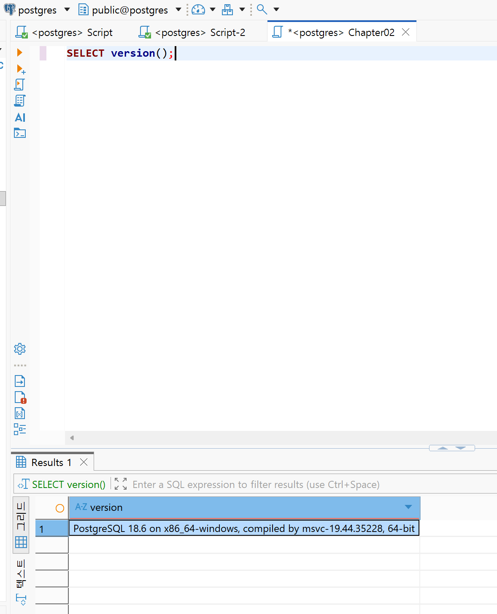

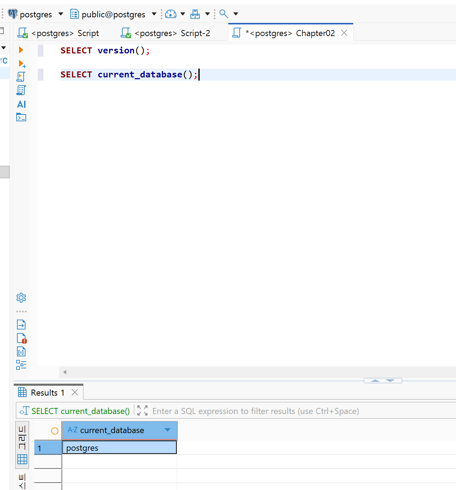

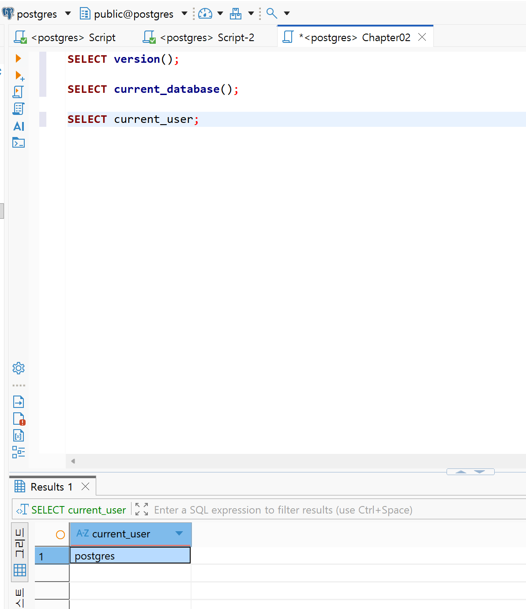

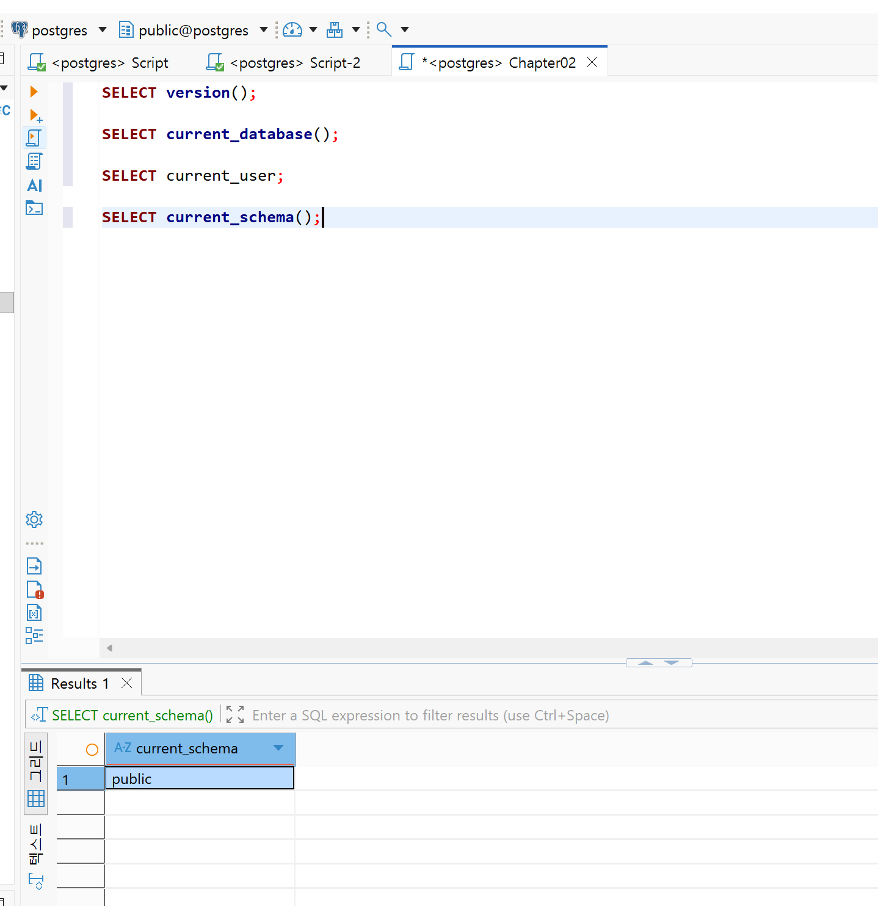

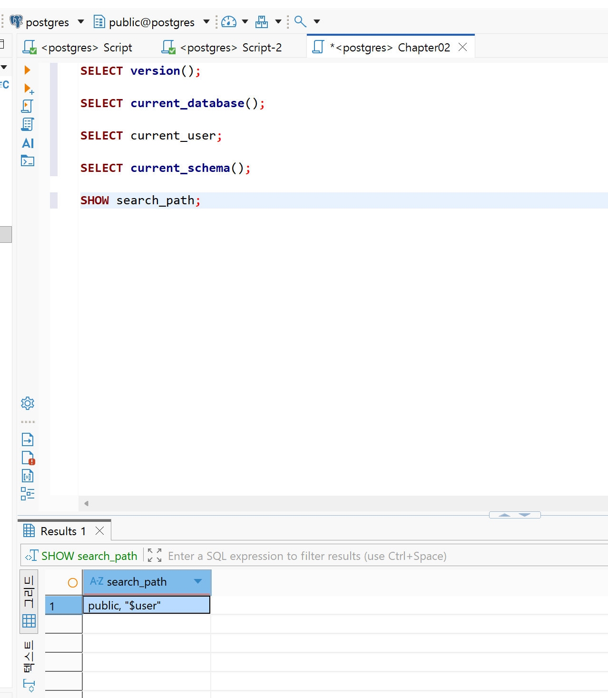

---

# 2. 데이터베이스 안의 스키마와 테이블 관찰

## 2-1. 스키마 조회 결과

실행한 SQL:

```sql
SELECT schema_name
FROM information_schema.schemata
ORDER BY schema_name;
```

관찰한 스키마 이름 중 3개 이내를 적습니다.

```text
1. public
2. practice
3. information_schema
```

### `public`은 무엇인가요?

```text
나의 설명:
public은 현재 데이터베이스 안에 존재하는 스키마 중 하나이다.
테이블과 같은 데이터베이스 객체를 구분하고 관리하는 공간으로 사용할 수 있다.
```

### 데이터베이스와 스키마는 같은 것인가요?

```text
나의 설명:
나의 설명:
같지 않다. 하나의 데이터베이스 안에는 여러 스키마가 존재할 수 있고,
각 스키마 안에서 테이블과 같은 객체들을 구분하여 관리할 수 있다.
```

## 2-2. 현재 보이는 테이블 조회

```sql
SELECT table_schema, table_name
FROM information_schema.tables
WHERE table_type = 'BASE TABLE'
  AND table_schema NOT IN ('pg_catalog', 'information_schema')
ORDER BY table_schema, table_name;
```

```text
조회된 사용자 테이블 수 또는 눈에 띈 테이블:
1개가 조회되었으며, practice 스키마의 members 테이블이 확인되었다.

아직 테이블이 거의 없어도 괜찮은 이유:
현재는 실습 초반 단계이고, 이전 과제에서 만든 TEMP TABLE은 세션이 종료되면 사라지기 때문에
사용자 테이블이 적게 조회되어도 문제가 없다.
```

## 2-3. 관찰 정리

```text
PostgreSQL 서버 안에는 여러 _________데이터베이스___________가 있을 수 있다.
한 데이터베이스 안에는 여러 ___________스키마_________가 있을 수 있다.
스키마 안에는 테이블과 같은 ___________객체_________가 존재한다.
```

---

# 3. TEMP TABLE로 테이블·행·열·키 직접 확인

## 3-1. 임시 테이블 생성 완료 확인

- [x] `ch02_students` 생성
- [x] `ch02_courses` 생성
- [x] `ch02_enrollments` 생성

각 테이블의 **한 행 의미**를 적습니다.

| 테이블 | 한 행의 의미 |
| --- | --- |
| `ch02_students` | 학생 한 명 |
| `ch02_courses` | 강의 한 개 |
| `ch02_enrollments` | 특정 학생이 특정 강의를 신청한 수강신청 한 건 |

## 3-2. 열의 의미 확인

### `ch02_students`

| 열 | 값의 의미 | 내부 식별자 / 업무 식별자 / 일반 속성 |
| --- | --- | --- |
| `id` | DB 내부에서 학생 행을 구분하는 값 | 내부 식별자 |
| `student_number` | 학교 업무에서 학생을 구분하기 위해 사용하는 학번 | 업무 식별자 |
| `name` | 학생 이름 | 일반 속성 |
| `major` | 학생 전공 | 일반 속성 |

### `ch02_enrollments`

| 열 | 값의 의미 | PK / FK / 일반 속성 |
| --- | --- | --- |
| `id` | 수강신청 한 건을 구분하는 식별자 | PK |
| `student_id` | 수강신청한 학생을 참조하는 값 | FK |
| `course_id` | 신청한 강의를 참조하는 값 | FK |
| `status` | 수강신청의 현재 상태 | 일반 속성 |

## 3-3. 입력된 행 수

```text
students 행 수:3
courses 행 수:2
enrollments 행 수:3
```

## 3-4. 내부 식별자와 업무 식별자

```text
students.id가 필요한 이유:
데이터베이스 내부에서 각 학생 행을 안정적으로 구분하기 위해 필요하다.

student_number가 필요한 이유:
학교 업무에서 실제 학생을 구분하기 위해 사용하는 학번을 저장하기 위해 필요하다.

둘을 항상 같은 값으로 사용하지 않아도 되는 이유:
id는 데이터베이스 내부 식별을 위한 값이고 student_number는 실제 업무에서 사용하는 식별자이므로 역할이 서로 다르기 때문이다.
```

## 3-5. 숫자처럼 보이는 학번을 문자열로 저장한 이유

```text
나의 설명:
학번은 계산하기 위한 숫자가 아니라 학생을 구분하기 위한 식별자이다.
또한 00123456처럼 앞자리의 0도 의미가 있으므로 숫자형보다 문자열로 저장하는 것이 적절하다.

ch02_students의 id=1
→ 학번 00123456, 김민지, 컴퓨터공학인 학생 한 명

ch02_courses의 id=10
→ DB101 데이터베이스 입문 강의 한 개

ch02_enrollments의 id=1001
→ 학생 id 1이 강의 id 10을 신청한 수강신청 한 건
```

---

# 4. 테이블과 조회 결과는 다르다

## 4-1. 원본 테이블 행 수

```text
ch02_students 전체 행 수:3
```

## 4-2. 일부 열만 조회

실행 SQL:

```sql
SELECT name, major
FROM ch02_students
ORDER BY id;
```

```text
원본 테이블의 열 수와 조회 결과의 열 수가 다른 이유:
원본 테이블에는 id, student_number, name, major의 4개 열이 있지만,
SELECT 문에서 name과 major만 선택했기 때문에 조회 결과에는 2개 열만 표시된다.
원본 테이블의 다른 열이 삭제된 것은 아니다.
```

## 4-3. 조건을 적용한 조회

실행 SQL:

```sql
SELECT id, student_number, name, major
FROM ch02_students
WHERE major = '컴퓨터공학'
ORDER BY id;
```

```text
원본 테이블 행 수:3
조회 결과 행 수:2
원본 테이블의 데이터가 삭제된 것인가?: 아니다.
그렇게 판단한 이유:
WHERE 조건에 맞는 학생만 조회 결과에 표시된 것이며,
COUNT(*)로 다시 확인했을 때 원본 테이블에는 여전히 3행이 존재했기 때문이다.
```

## 4-4. 정렬 결과 비교

```sql
SELECT id, name
FROM ch02_students
ORDER BY name ASC;

SELECT id, name
FROM ch02_students
ORDER BY name DESC;
```

```text
ASC 결과의 첫 학생:김민지
DESC 결과의 첫 학생:이준호

이 실험을 통해 ORDER BY에 대해 알게 된 점:
ORDER BY를 사용하면 지정한 열을 기준으로 조회 결과의 순서를 명확하게 정할 수 있다.
순서가 중요한 경우 화면에 우연히 보이는 순서를 기준으로 판단하지 않고
ORDER BY로 정렬 기준을 지정해야 한다.
```

## 4-5. 증거 화면

권장 경로:

```text
assignments/chapter02/images/step04_result_set.png
```

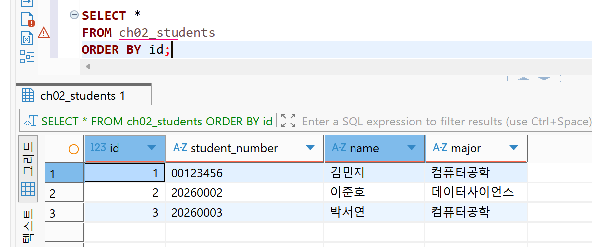

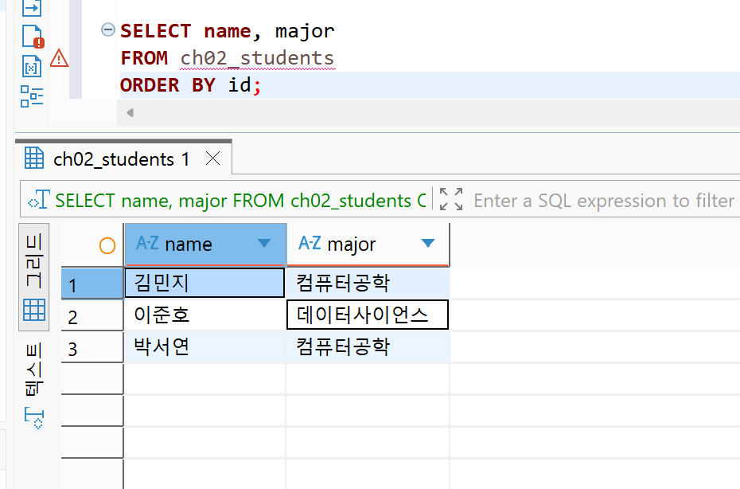

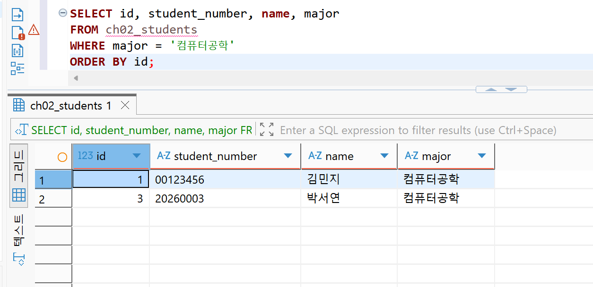

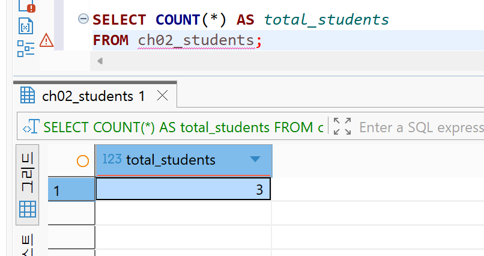

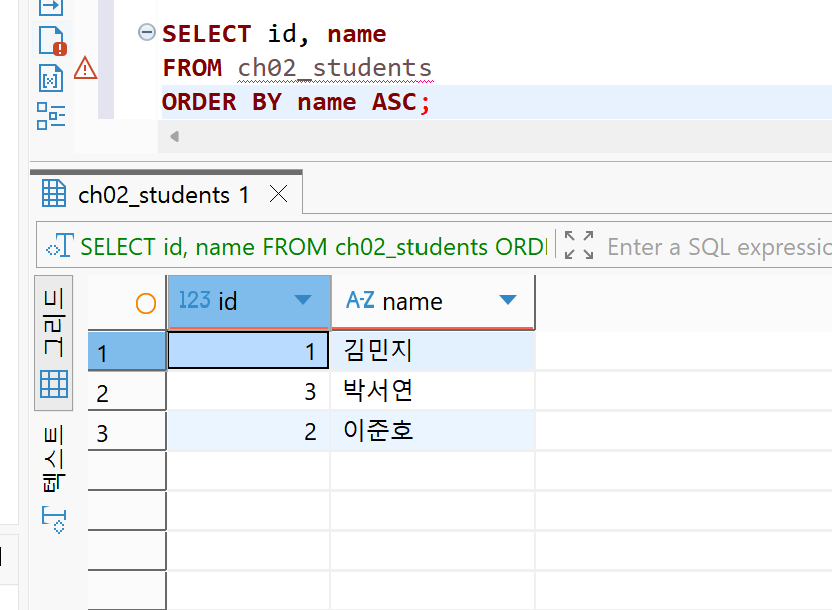

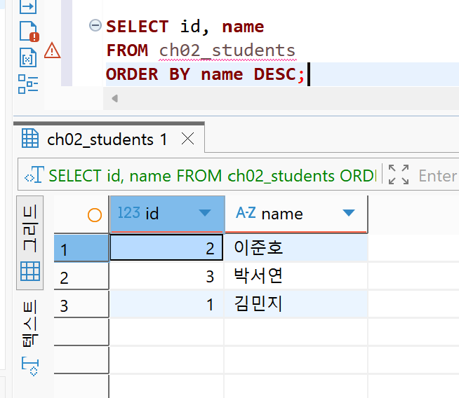

---

# 5. PK와 FK를 실제로 관찰

## 5-1. 정상 데이터의 관계 읽기

다음 SQL 결과를 보고 작성합니다.

```sql
SELECT
    e.id AS enrollment_id,
    s.name AS student_name,
    c.title AS course_title,
    e.status
FROM ch02_enrollments AS e
JOIN ch02_students AS s
    ON s.id = e.student_id
JOIN ch02_courses AS c
    ON c.id = e.course_id
ORDER BY e.id;
```

```text
한 행이 의미하는 것:
특정 학생이 특정 강의를 신청한 수강신청 한 건과 그 상태를 의미한다.

같은 student_id가 여러 enrollment 행에서 반복될 수 있는 이유:
학생 한 명이 여러 강의를 신청할 수 있으므로 같은 학생을 참조하는 여러 수강신청 행이 존재할 수 있기 때문이다.

같은 course_id가 여러 enrollment 행에서 반복될 수 있는 이유:
하나의 강의를 여러 학생이 신청할 수 있으므로 같은 강의를 참조하는 여러 수강신청 행이 존재할 수 있기 때문이다.
```

## 5-2. 기본키 중복 오류 관찰

중복 PK 입력을 시도한 결과:

```text
실행 성공 / 실패:실패
오류 메시지에서 확인한 핵심 단어:
duplicate key value violates unique constraint, ch02_students_pkey, Key (id)=(1) already exists.
왜 실패했다고 생각하는가:
id=1은 이미 존재하는 기본키 값이므로 같은 테이블에서 다시 사용할 수 없기 때문이다.
```

## 5-3. 존재하지 않는 학생을 참조하는 FK 오류 관찰

존재하지 않는 `student_id`를 사용한 수강신청 입력 결과:

```text
실행 성공 / 실패:실패
오류 메시지에서 확인한 핵심 단어:
foreign key, ch02_enrollments_student_id_fkey, student_id=999
왜 실패했다고 생각하는가:
student_id=999에 해당하는 학생이 ch02_students 테이블에 존재하지 않기 때문에
FK 제약조건에 의해 입력이 거부되었다.
```

## 5-4. PK와 FK의 차이 정리

```text
PK는 __________________같은 테이블 안에서 각 행을 고유하게 식별_______________________________ 하기 위한 키이다.

FK는 __________________다른 테이블의 행을 참조하여 테이블 사이의 관계를 표현_______________________________ 하기 위한 키이다.

FK 값이 여러 행에서 반복될 수 있는 이유는
_______________________여러 행이 같은 부모 행을 참조하는 1:N 관계가 존재할 수 있기_______________________________ 때문이다.
```

## 5-5. 증거 화면

권장 경로:

```text
assignments/chapter02/images/step05_pk_fk.png
```

> 오류 메시지는 전체 화면이 아니라 테이블명·constraint·참조 오류가 보이는 정도만 캡처합니다.

`여기에 STEP 5 핵심 증거 화면을 삽입하세요.`

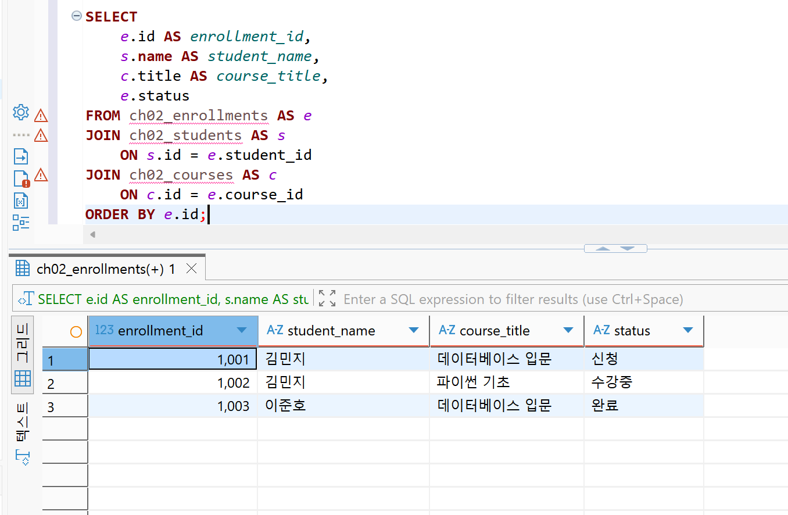

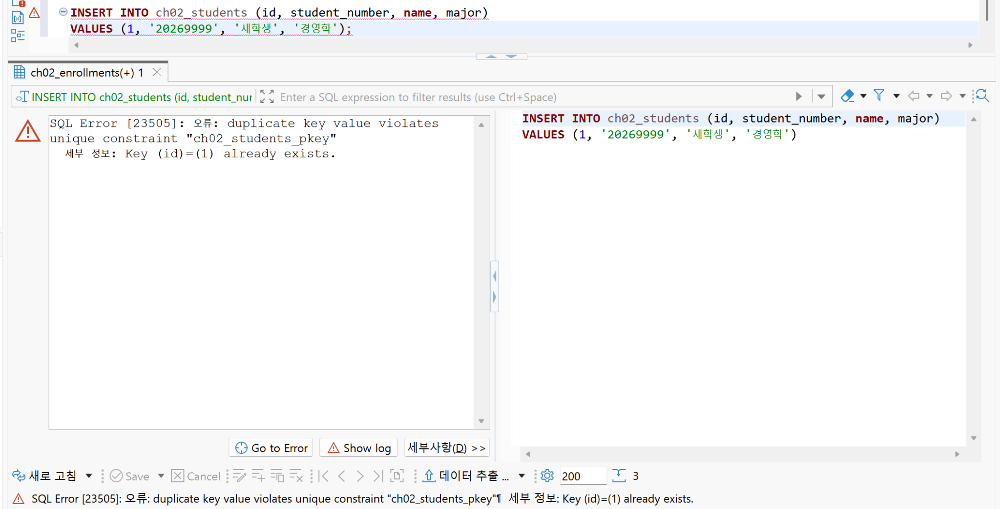

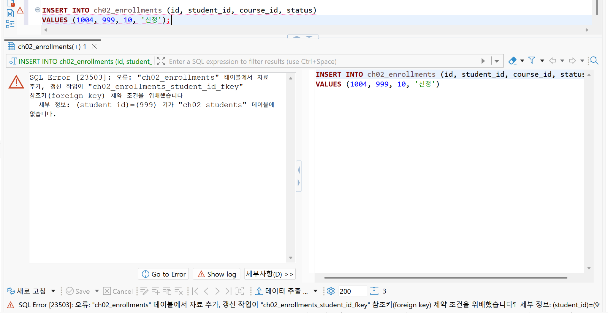

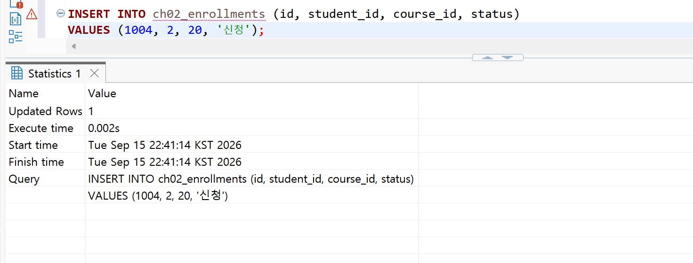

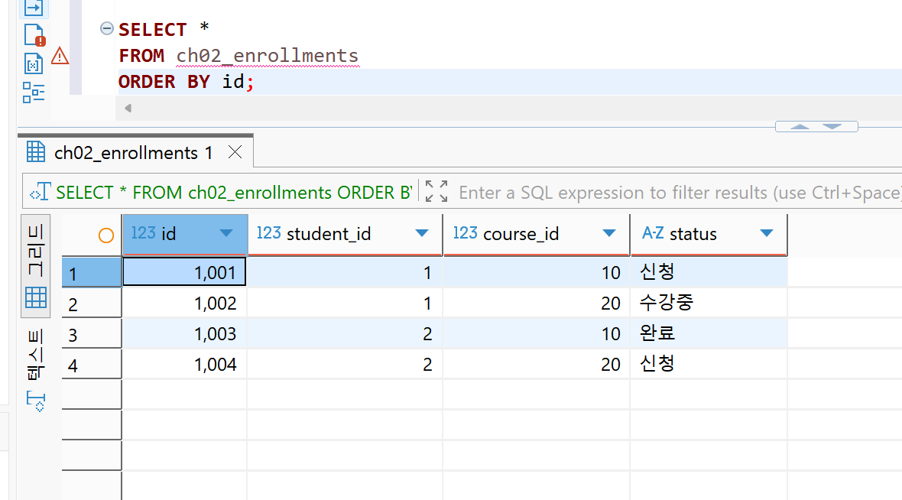

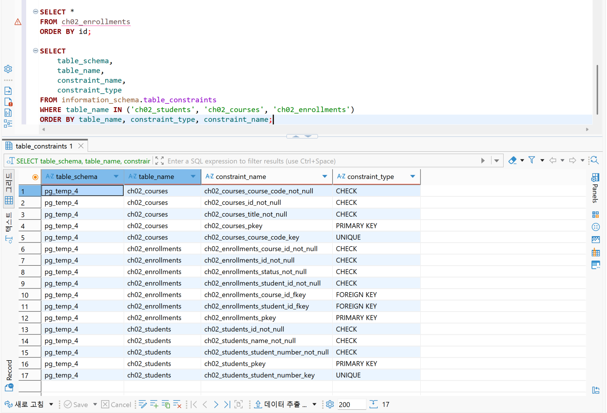

---

# 6. 관계와 카디널리티를 자연어로 설명

현재 임시 데이터 기준으로 작성합니다.

```text
학생 한 명은 여러 수강신청을 가질 수 있는가?:
그렇다. 현재 데이터에서 student_id 1과 2가 각각 2개의 수강신청을 가지고 있다.

강의 한 개는 여러 수강신청을 가질 수 있는가?:
그렇다. 현재 데이터에서 course_id 10과 20이 각각 2개의 수강신청을 가지고 있다.

수강신청 한 건은 학생 몇 명을 참조하는가?:
학생 한 명을 참조한다.

수강신청 한 건은 강의 몇 개를 참조하는가?:
강의 한 개를 참조한다.
```

아래 구조를 완성합니다.

```text
students 1 ── ___N___ enrollments ___N___ ── 1 courses
```

### 학생과 강의가 N:M 관계라고 볼 수 있는 이유

```text
나의 설명:
학생 한 명은 여러 강의를 신청할 수 있고, 강의 한 개도 여러 학생에게 신청될 수 있기 때문이다.
따라서 학생과 강의는 서로 여러 개와 연결될 수 있는 N:M 관계로 볼 수 있으며,
enrollments 테이블이 이를 두 개의 1:N 관계로 연결해 준다.
```

> 아직 0개 허용 여부, 필수 관계, 삭제 정책까지 확정하지 않습니다. 그런 규칙은 Chapter 05~06에서 다룹니다.

---

# 7. AI가 만든 테이블 구조 직접 검토

## 7-1. AI에게 묻기 전에 내가 먼저 찾은 문제

다음 구조를 보고 최소 4개를 적습니다.

```sql
CREATE TABLE student_courses (
    student_name VARCHAR(50),
    student_email VARCHAR(100),
    course_title VARCHAR(100),
    instructor_name VARCHAR(50)
);
```

```text
문제 1.
각 행을 고유하게 구분할 수 있는 PK가 없다.
문제 2.
같은 학생이 여러 강의를 들으면 학생 정보가 반복될 수 있다.
문제 3.
같은 학생이 여러 강의를 들으면 학생 정보가 반복될 수 있다.
문제 4.
학생과 강의 사이의 관계를 명확하게 표현하기 어렵다.
문제 5.
한 행이 학생 자체를 의미하는지, 강의 자체를 의미하는지,
수강신청 한 건을 의미하는지 명확하지 않다.
```

## 7-2. AI 검토 요청 프롬프트

사용한 핵심 프롬프트를 기록합니다.

```text
나는 PostgreSQL과 데이터베이스를 처음 배우는 학생입니다.
아직 정규화와 ERD를 정식으로 배우기 전입니다.

다음 테이블 구조를 검토해 주세요.

CREATE TABLE student_courses (
    student_name VARCHAR(50),
    student_email VARCHAR(100),
    course_title VARCHAR(100),
    instructor_name VARCHAR(50)
);

완성된 정답 설계를 바로 만들어 주지 말고 다음 질문 중심으로 설명해 주세요.

1. 한 행의 의미가 명확한가?
2. PK 후보가 필요한가?
3. 내부 식별자와 업무 식별자를 구분할 필요가 있는가?
4. FK로 표현해야 할 관계 후보는 무엇인가?
5. 중복 저장 위험이 있는가?
6. 현재 요구사항만으로 결정할 수 없는 정책은 무엇인가?

확정되지 않은 업무 규칙은 임의로 결정하지 마세요.
```

## 7-3. AI 제안과 나의 판단

| AI의 지적 또는 제안 | 동의 / 수정 / 보류 | 나의 근거 |
| --- | --- | --- |
| 한 행의 의미가 불명확하다. | 동의 | 학생 정보와 강의 정보가 한 행에 함께 있어 무엇을 나타내는 행인지 먼저 정해야 한다. |
| PK가 필요하다. | 동의 | 각 행을 고유하게 구분할 수 있는 기준이 현재 테이블에 명확하지 않다. |
| 학생과 강의 정보를 분리하는 것이 좋다. | 동의 | 같은 학생이나 강의 정보가 여러 행에 반복 저장될 가능성이 있기 때문이다. |
| 학생과 강의의 관계를 FK로 표현할 수 있다. | 동의 | 수강신청처럼 두 대상을 연결하는 관계를 명확하게 표현할 수 있기 때문이다. |
| 이메일을 반드시 UNIQUE로 지정해야 한다. | 보류 | 이메일 중복 허용 여부는 현재 요구사항만으로 확정할 수 없는 업무 정책이기 때문이다. |


## 7-4. 본문과 대조한 항목

AI 설명 중 최소 하나를 `chapter02.md`와 비교합니다.

```text
AI가 설명한 내용:
FK는 다른 테이블의 행을 참조하는 값이며, 1:N 관계에서는 같은 FK 값이 여러 행에서 반복될 수 있다고 설명했다.

본문에서 확인한 내용:
Chapter 02 본문에서도 FK는 자동으로 UNIQUE가 되는 값이 아니며,
여러 행이 같은 부모 행을 참조하는 경우 같은 FK 값이 반복될 수 있다고 설명한다.

일치 / 부분 일치 / 수정 필요:
일치

내가 최종적으로 이해한 내용:
FK는 다른 테이블의 행을 참조하여 관계를 표현하는 키이며,
PK처럼 반드시 고유해야 하는 값은 아니다.
1:N 관계에서는 여러 행이 같은 부모 행을 참조할 수 있으므로 같은 FK 값이 반복될 수 있다.
```

## 7-5. 증거 화면

권장 경로:

```text
assignments/chapter02/images/step07_ai_review.png
```

`여기에 AI 검토 과정의 핵심 화면을 삽입하세요.`

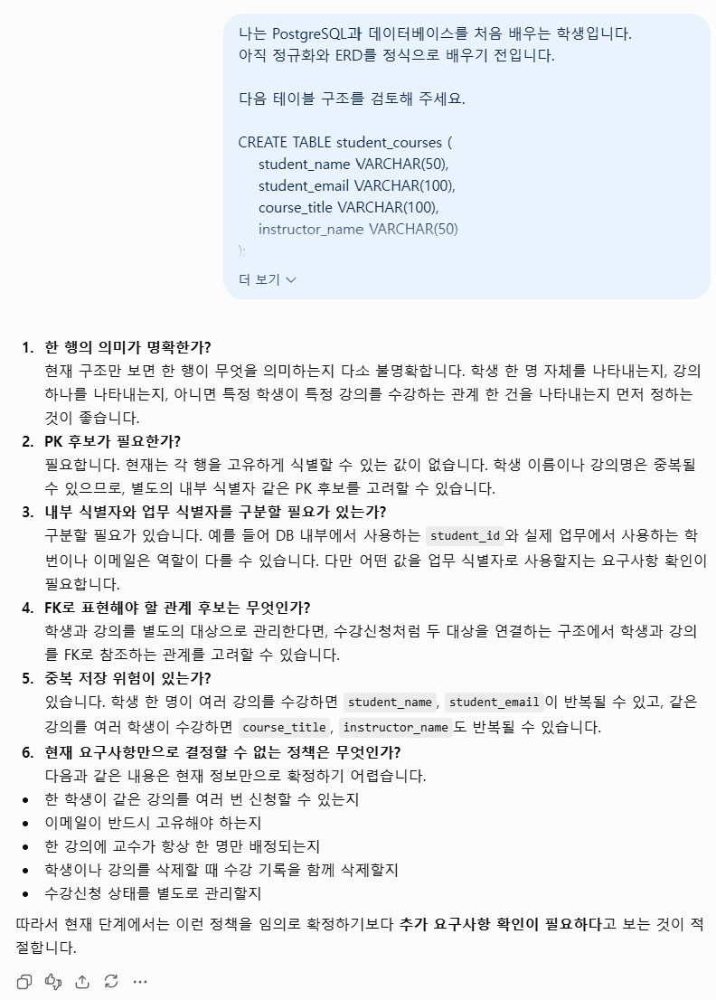

---

# 8. Chapter 01의 개인 서비스 아이디어를 DB 용어로 다시 표현

Chapter 01에서 정한 개인 서비스 주제를 그대로 사용하거나 새 주제를 정해도 됩니다.

## 8-1. 서비스 기본 정보

```text
서비스 이름:
스터디 모임 관리 서비스
서비스 목적:
회원이 스터디에 참여를 신청하고, 스터디별 모임 일정과 참여 상태를 관리할 수 있도록 하는 서비스이다.
```

## 8-2. PostgreSQL 구조 후보

```text
데이터베이스 이름 후보:
study_management
스키마 이름 후보:
study_service
```

> 아직 실제 데이터베이스나 스키마를 생성하지 않아도 됩니다.

## 8-3. 테이블 후보와 한 행 의미

최소 3개를 작성합니다.

| 테이블 후보 | 한 행의 의미 | 내부 ID 후보 | 업무 식별자 후보 |
| --- | --- | --- | --- |
| `members` | 회원 한 명 | `member_id` | 이메일 또는 회원번호 후보 |
| `studies` | 스터디 한 개 | `study_id` | 스터디 코드 후보 |
| `applications` | 한 회원이 한 스터디에 참여 신청한 한 건 | `application_id` | 확인 필요 |
| `meetings` | 한 스터디에서 진행하는 모임 일정 한 건 | `meeting_id` | 확인 필요 |
| `participation_status` | 참여 신청 또는 참여 상태 한 건 | `status_id` | 확인 필요 |


## 8-4. FK 후보

```text
1. ____applications____.____member_id____ → ___members_____.____member_id____
   이유:
   참여 신청 한 건이 어떤 회원의 신청인지 나타내기 위해 회원을 참조해야 하기 때문이다.

2. ____applications____.____study_id____ → ____studies____.____study_id____
   이유:
   참여 신청 한 건이 어떤 스터디에 대한 신청인지 나타내기 위해 스터디를 참조해야 하기 때문이다.

 3. ____meetings____.______study_id_______ → ______studies____.____study_id___
   이유:
   각 모임 일정이 어느 스터디에 속하는지 표현하기 위해 스터디를 참조할 수 있다.
```

## 8-5. 자연어 관계 문장

```text
1. 회원 한 명은 여러 스터디에 참여 신청을 할 수 있다.

2. 스터디 한 개는 여러 회원의 참여 신청을 받을 수 있다.

3. 스터디 한 개는 여러 모임 일정을 가질 수 있다.
```

## 8-6. 아직 확정하지 않을 정책

```text
Q1. 한 회원이 같은 스터디에 여러 번 참여 신청할 수 있는가?

Q2. 참여 신청이 승인된 이후 취소되면 기존 신청 기록을 삭제할 것인가, 상태로 남길 것인가?

Q3. 회원이나 스터디가 삭제될 때 관련 참여 신청과 모임 일정 기록은 어떻게 처리할 것인가?
```

---

# 9. AI를 개인 구조의 검토자로 사용

## 9-1. 사용한 프롬프트

```text
나는 데이터베이스 초보자입니다.
Chapter 02까지 학습했고 아직 ERD와 정규화는 정식으로 배우지 않았습니다.

내 서비스 구조 초안은 다음과 같습니다.

서비스 이름: 스터디 모임 관리 서비스

테이블 후보와 한 행의 의미:
- members: 회원 한 명
- studies: 스터디 한 개
- applications: 한 회원이 한 스터디에 참여 신청한 한 건
- meetings: 한 스터디에서 진행하는 모임 일정 한 건
- participation_status: 참여 신청 또는 참여 상태 한 건

내부 식별자 후보:
- members.member_id
- studies.study_id
- applications.application_id
- meetings.meeting_id
- participation_status.status_id

FK 후보:
- applications.member_id → members.member_id
- applications.study_id → studies.study_id
- meetings.study_id → studies.study_id

아직 확정하지 않은 정책:
- 한 회원이 같은 스터디에 여러 번 신청할 수 있는가?
- 취소된 신청 기록을 삭제할 것인가, 상태로 남길 것인가?
- 회원이나 스터디가 삭제될 때 관련 기록을 어떻게 처리할 것인가?

정답 설계를 대신 만들어 주지 말고 다음 관점에서 질문 형태로 검토해 주세요.

1. DBMS / database / schema / table을 혼동한 곳이 있는가?
2. 한 행의 의미가 모호한 곳이 있는가?
3. 내부 식별자와 업무 식별자를 혼동한 곳이 있는가?
4. PK와 FK 역할을 잘못 이해한 곳이 있는가?
5. FK가 필요하지만 빠진 관계 후보가 있는가?
6. 아직 업무 담당자에게 확인해야 할 정책은 무엇인가?

근거 없이 정책을 확정하지 마세요.
```

## 9-2. AI가 질문한 내용 중 유용했던 것

```text
1. participation_status를 별도 테이블로 관리해야 하는지, applications의 상태 속성으로 두어도 되는지 확인한 질문이 유용했다.

2. members의 이메일이나 회원번호 중 실제 업무에서 사용하는 식별자가 무엇인지 확인해야 한다는 질문이 유용했다.

3. 한 회원이 같은 스터디에 여러 번 신청할 수 있는지 확인해야 중복 신청에 대한 제약조건을 나중에 결정할 수 있다는 질문이 유용했다.
```

## 9-3. AI가 너무 빨리 결정한 내용 또는 내가 보류한 내용

```text
1. 회원 이메일을 반드시 UNIQUE로 지정하는 것은 실제 서비스에서 이메일을 업무 식별자로 사용하는지 확인되지 않았으므로 보류했다.

2. 회원 또는 스터디 삭제 시 관련 참여 신청과 모임 기록을 자동으로 삭제하는 정책은 운영 규칙이 정해지지 않았으므로 보류했다.
```

## 9-4. 검토 후 수정한 구조

| 수정 전 | 수정 후 | 수정 이유 |
| --- | --- | --- |
| `participation_status`를 별도 테이블 후보로 둠 | 참여 상태를 우선 `applications`의 속성 후보로 검토하고 별도 테이블 여부는 보류 | 상태 자체가 독립된 한 행의 의미를 갖는지 명확하지 않기 때문 |
| `members`의 업무 식별자를 이메일 또는 회원번호 후보로 작성 | 업무 식별자는 `확인 필요`로 변경 | 실제 운영에서 어떤 값을 회원 식별자로 사용하는지 아직 확인되지 않았기 때문 |
| 한 회원의 동일 스터디 중복 신청 여부를 정하지 않음 | 중복 신청 허용 여부를 미확정 정책으로 계속 유지 | 요구사항 없이 UNIQUE 등의 제약조건을 임의로 결정하면 안 되기 때문 |


---

# 10. 최종 개념 정리

아래 문장을 본인의 말로 완성합니다.

```text
PostgreSQL은 
데이터베이스를 생성하고 관리하며 SQL을 실행할 수 있게 해 주는 DBMS이다.

DBeaver 또는 psql은
PostgreSQL에 접속해서 SQL을 작성하고 실행하며 결과를 확인할 수 있게 해 주는 도구이다.

데이터베이스와 스키마의 차이는
데이터베이스가 더 큰 관리 단위이고, 그 안에 여러 스키마가 존재할 수 있다는 점이다.

테이블 한 행은 
그 테이블에서 관리하려는 대상이나 사건 한 건을 의미한다.

조회 결과가 원본 테이블과 다른 이유는 
SELECT 문에서 선택한 열, 조건, 정렬 방식에 따라 원본 데이터의 일부만 화면에 나타날 수 있기 때문이다.

내부 식별자와 업무 식별자의 차이는 
내부 식별자는 DB 안에서 행을 안정적으로 구분하기 위한 값이고,
업무 식별자는 실제 업무에서 대상을 구분하기 위해 사용하는 값이라는 점이다.

PK는 같은 테이블 안에서 각 행을 고유하게 식별하기 위한 키이다.


FK는 다른 테이블의 행을 참조하여 테이블 사이의 관계를 표현하기 위한 키이다.
```

---

# 11. 이번 Chapter에서 새롭게 알게 된 점

최소 3개를 작성합니다.

```text
1. PostgreSQL, 데이터베이스, 스키마, 테이블이 서로 같은 개념이 아니라 계층적으로 구분되는 구조라는 것을 알게 되었다.

2. SELECT로 일부 열이나 일부 행만 조회하더라도 원본 테이블의 데이터가 삭제되는 것은 아니며, 조회 결과는 원본 테이블과 다른 결과 집합이라는 것을 알게 되었다.

3. PK는 각 행을 고유하게 식별하기 위한 키이고, FK는 다른 테이블의 행을 참조하여 관계를 표현하는 키라는 것을 실제 오류 실습을 통해 이해했다.

4. FK는 PK처럼 항상 고유한 값일 필요가 없으며, 1:N 관계에서는 같은 FK 값이 여러 행에서 반복될 수 있다는 것을 알게 되었다.

5. 데이터베이스 구조를 설계할 때는 테이블 이름보다 먼저 '한 행이 무엇을 의미하는가'를 명확하게 정하는 것이 중요하다는 것을 알게 되었다.
```

## 아직 헷갈리는 내용

```text
1. 실제 프로젝트에서 하나의 정보를 별도 테이블로 분리할지, 기존 테이블의 속성으로 둘지 판단하는 기준이 아직 완전히 익숙하지 않다.

2. 실제 서비스에서 내부 식별자와 업무 식별자 중 어떤 값에 UNIQUE 같은 제약조건을 적용해야 하는지 결정하는 과정이 아직 헷갈린다.
```

## AI에게 다시 질문하고 싶은 내용

```text
실제 데이터베이스를 설계할 때 어떤 경우에 새로운 테이블을 만들고, 어떤 경우에는 기존 테이블의 열로 두는 것이 적절한지 구체적인 예시와 함께 더 배우고 싶다.
```

---

# 12. 제출 전 자기 점검

- [x] PostgreSQL에서 현재 database / schema / search_path를 확인했다.
- [x] DBMS, database, schema, table을 구분해서 설명할 수 있다.
- [x] TEMP TABLE 3개를 생성하고 직접 데이터를 조회했다.
- [x] 각 테이블의 한 행 의미를 작성했다.
- [x] 테이블과 조회 결과가 다르다는 것을 실제 SQL로 확인했다.
- [x] `ORDER BY`를 사용하지 않으면 업무 순서를 가정하면 안 된다는 점을 이해했다.
- [x] 내부 식별자와 업무 식별자의 차이를 설명할 수 있다.
- [x] PK 중복 입력 실패를 직접 확인했다.
- [x] 존재하지 않는 FK 참조 실패를 직접 확인했다.
- [x] FK 값이 반복될 수 있는 이유를 설명할 수 있다.
- [x] AI가 만든 테이블을 내가 먼저 검토했다.
- [x] AI 설명 중 최소 하나를 본문과 대조했다.
- [x] 개인 서비스의 테이블 후보를 3개 이상 작성했다.
- [x] 개인 서비스의 FK 후보와 미확정 정책을 기록했다.
- [x] 실제 비밀번호·API Key·민감한 접속 정보가 포함되지 않았는지 확인했다.
- [x] 이미지 링크가 GitHub에서 정상적으로 보이는지 확인했다.

---

# 13. GitHub 제출 정보

답안 파일 권장 위치:

```text
assignments/chapter02/chapter02_answer.md
```

이미지 권장 위치:

```text
assignments/chapter02/images/
```

LMS 제출 URL 형식:

```text
https://github.com/<본인-GitHub-ID>/<본인-저장소>/blob/main/assignments/chapter02/chapter02_answer.md
```

## 최종 확인

- [ ] 위 URL을 로그아웃 상태 또는 다른 브라우저에서 열어도 확인 가능하다.
- [ ] Markdown이 정상 렌더링된다.
- [ ] 이미지가 깨지지 않는다.
- [ ] LMS에 교수자 템플릿 URL이 아니라 **내 답안 파일 URL**을 제출했다.
