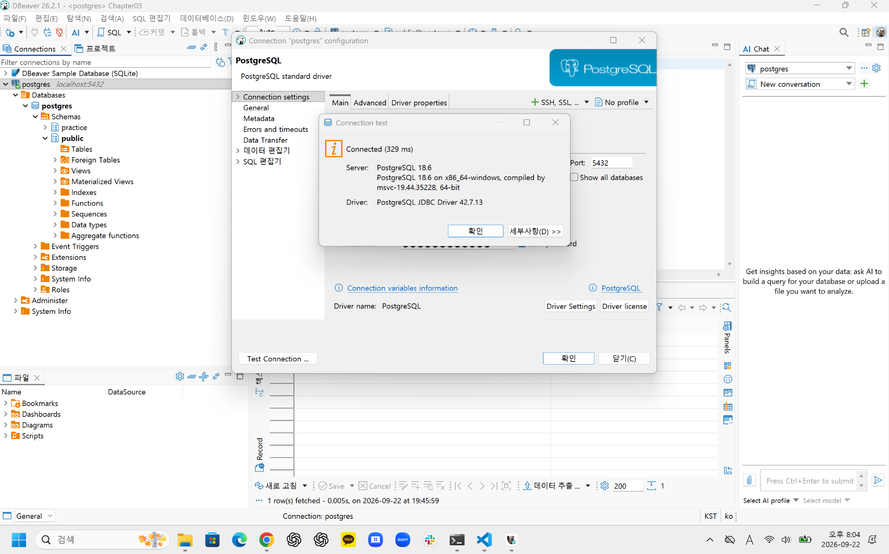
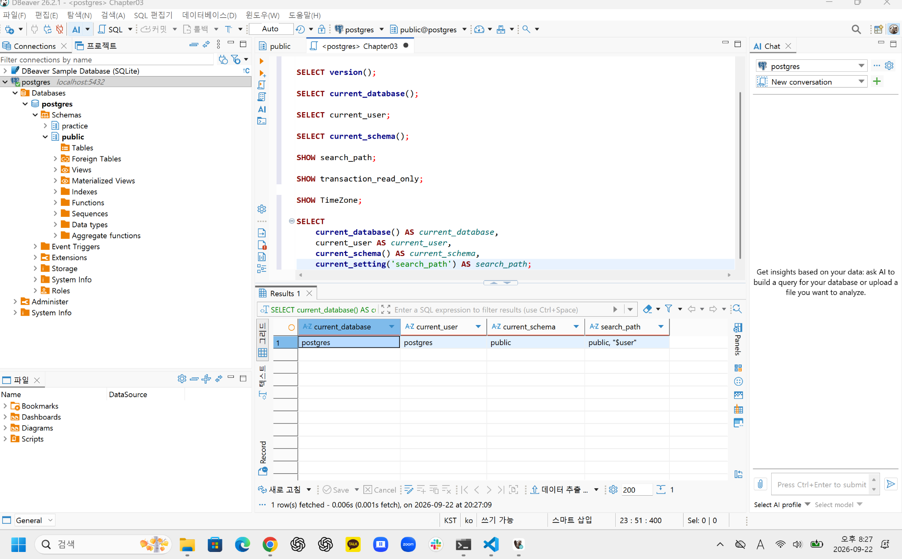
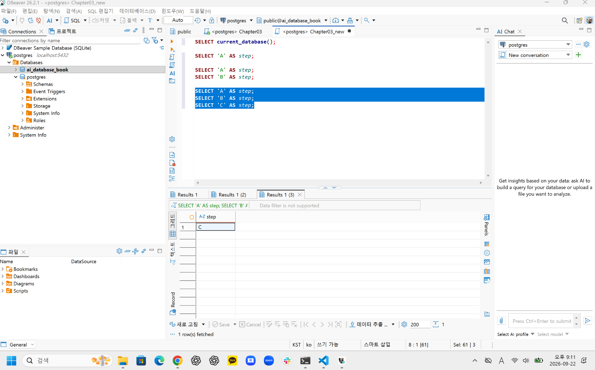

# Chapter 03 확장 실습 답안 템플릿

> **과제:** PostgreSQL과 DBeaver로 실습 환경 검증하기  
> **사용 방법:** 이 파일을 내려받아 본인의 GitHub 저장소에 `chapter03_answer.md`라는 이름으로 저장한 뒤 실습하면서 바로 작성합니다.  
> **제출 방법:** LMS에는 파일을 직접 업로드하지 않고, **본인 GitHub 저장소의 `chapter03_answer.md` 파일 URL**을 제출합니다.

---

## 제출 전 보안 주의

이 과제 파일과 캡처 화면에는 다음 정보를 올리지 않습니다.

```text
실제 PostgreSQL 비밀번호
전체 DB 접속 URL
API Key / Token
개인정보
공개할 필요가 없는 사내 서버 주소
```

LMS에서 제출자를 확인할 수 있으므로 공개 저장소의 답안 파일에 학번이나 실명을 반드시 적을 필요는 없습니다.

```text
GitHub 계정 또는 별칭:yangguebeom
과제 작성일:2026-09-22
사용한 AI 도구:ChatGPT
```

---

# 1. PostgreSQL과 DBeaver 환경 확인

## 1-1. 내 환경

| 항목 | 작성 내용 |
| --- | --- |
| 운영체제 | Windows |
| PostgreSQL 버전 | 18.6 |
| DBeaver 버전 | 26.2.1 |
| Host | localhost |
| Port | 5432 |
| Database | postgres |
| Username | postgres |

> 비밀번호는 기록하지 않습니다.

## 1-2. PostgreSQL과 DBeaver 역할 설명

```text
PostgreSQL은:
데이터를 실제로 저장하고 관리하며 SQL 명령을 처리하는 데이터베이스 관리 시스템(DBMS)이다.

DBeaver는:
PostgreSQL과 같은 DBMS에 접속하여 데이터베이스를 확인하고 SQL을 작성·실행할 수 있게 해 주는 클라이언트 프로그램이다.

두 프로그램의 차이는:
PostgreSQL은 실제 데이터베이스를 관리하고 SQL을 처리하는 DBMS이고, DBeaver는 사용자가 PostgreSQL에 편리하게 접속하고 작업할 수 있도록 도와주는 프로그램이라는 점이다.
```

---

# 2. 연결 테스트와 첫 SQL

## 2-1. DBeaver 연결 결과

- [x] PostgreSQL 연결 유형 선택
- [x] Host 확인
- [x] Port 확인
- [x] Database 확인
- [x] Username 확인
- [x] Test Connection 성공

### 연결 성공 화면

권장 이미지 경로:

```text
assignments/chapter03/images/step02_connection.png
```




## 2-2. 첫 SQL 실행

```sql
SELECT 1 + 1 AS result;
```

실행 전 예상:

```text
2
```

실제 결과:

```text
2
```

이 결과가 의미하는 것:

```text
DBeaver에서 작성한 SQL이 PostgreSQL에 정상적으로 전달되어 실행되었고,
PostgreSQL에서 계산한 결과가 다시 DBeaver에 정상적으로 표시되었다는 의미이다.
```

---

# 3. 현재 연결 위치를 SQL로 검증

다음 SQL을 실행합니다.

```sql
SELECT version();
SELECT current_database();
SELECT current_user;
SELECT current_schema();
SHOW search_path;
SHOW transaction_read_only;
SHOW TimeZone;
```

## 3-1. 결과 기록

| 확인 항목 | 실제 결과 | 내가 이해한 의미 |
| --- | --- | --- |
| `version()` | PostgreSQL 18.6 on x86_64-windows, compiled by msvc-19.44.35228, 64-bit | 현재 접속한 PostgreSQL 서버의 버전과 실행 환경을 보여준다. |
| `current_database()` | postgres | 현재 세션이 실제로 접속한 데이터베이스 이름이다. |
| `current_user` | postgres | 현재 PostgreSQL 세션에서 사용 중인 사용자이다. |
| `current_schema()` | public | 현재 검색 경로에서 우선 사용되는 스키마를 보여준다. |
| `search_path` | public, "$user" | 스키마 이름을 생략했을 때 PostgreSQL이 객체를 찾는 검색 경로를 보여준다. |
| `transaction_read_only` | off | 현재 트랜잭션이 읽기 전용 상태가 아니라는 뜻이다. |
| `TimeZone` | Asia/Seoul | 현재 PostgreSQL 세션의 시간대가 서울 시간대로 설정되어 있다는 뜻이다. |

## 3-2. 반드시 설명할 것

### DBeaver 연결 이름과 `current_database()`는 왜 같은 개념이 아닌가요?

```text
DBeaver의 연결 이름은 사용자가 연결을 구분하기 위해 붙인 표시 이름이고,
current_database()는 PostgreSQL이 현재 세션에서 실제로 접속하고 있는
데이터베이스 이름을 반환하기 때문에 서로 같은 개념이 아니다.
```

### `current_schema()`와 `search_path`는 어떤 관계가 있나요?

```text
search_path는 스키마 이름을 생략했을 때 PostgreSQL이 객체를 찾는 검색 경로이고,
current_schema()는 그 검색 경로에서 현재 우선적으로 사용되는 스키마를 보여준다.
따라서 current_schema()가 public이라고 해서 데이터베이스에 public 스키마만
존재한다는 뜻은 아니다.
```

### `transaction_read_only = off`라는 결과만으로 모든 테이블을 만들 권한이 있다고 단정할 수 있나요?

```text
아니다. transaction_read_only = off는 현재 세션이 읽기 전용 상태가 아니라는 의미일 뿐이다.
실제로 테이블을 생성하거나 데이터를 변경할 수 있는지는 해당 데이터베이스와 스키마에
부여된 CREATE, INSERT 등의 권한을 별도로 확인해야 한다.
```

## 3-3. 증거 화면

권장 경로:

```text
assignments/chapter03/images/step03_location_check.png
```



---

# 4. `ai_database_book` 데이터베이스 확인

## 4-1. 현재 데이터베이스

```sql
SELECT current_database();
```

실제 결과:

```text
postgres
```

- [ ] 결과가 `ai_database_book`이다.
- [x] 다른 DB라면 올바른 연결로 전환했다.

## 4-2. 연결을 바꾼 뒤 다시 검증

```text
전환 전 데이터베이스:postgres
전환 후 데이터베이스:ai_database_book
전환 여부를 판단한 근거:SELECT current_database(); 실행 결과가 ai_database_book으로 확인되었다.
```

### 화면에서 보이는 연결 이름만 믿지 않고 SQL을 다시 실행해야 하는 이유

```text
DBeaver에 표시되는 연결 이름은 사용자가 구분하기 위해 붙인 이름일 수 있으므로
실제로 접속된 데이터베이스와 반드시 일치한다고 볼 수 없다.
따라서 연결을 변경한 뒤 SELECT current_database();를 다시 실행하여
현재 세션이 실제로 어느 데이터베이스에 연결되어 있는지 확인해야 한다.
```

---

# 5. SQL 실행 범위 실험

SQL Editor에 다음 세 문장을 입력합니다.

```sql
SELECT 'A' AS step;
SELECT 'B' AS step;
SELECT 'C' AS step;
```

## 5-1. 한 문장 실행

```text
내가 실행한 문장:SELECT 'A' AS step;
실제 결과:A
```

## 5-2. 선택 영역 실행

```text
선택한 문장:
SELECT 'A' AS step;
SELECT 'B' AS step;
실제 결과:
A와 B가 모두 실행되었고, 각각 별도의 결과 탭으로 표시되었다.
```

## 5-3. 전체 스크립트 실행

```text
실제 결과:
A, B, C가 모두 실행되었다.
결과 탭 또는 실행 순서에서 관찰한 점:
선택한 세 SQL 문이 위에서 아래 순서대로 실행되었고,
각 문장의 결과가 별도의 결과 탭으로 표시되었다.
```

## 5-4. 결과 해석

```text
한 문장 실행과 전체 스크립트 실행의 차이:
한 문장 실행은 현재 커서가 위치한 SQL 문 하나만 실행하지만,
선택 영역이나 전체 스크립트 실행은 여러 SQL 문을 한 번에 실행할 수 있다는 차이가 있다.

변경 SQL에서 실행 범위를 잘못 선택하면 위험한 이유:
SELECT 문만 실행하려고 했는데 UPDATE나 DELETE 같은 데이터 변경 SQL까지
포함해서 실행하면 의도하지 않은 데이터 수정이나 삭제가 발생할 수 있기 때문이다.
따라서 실행 전에 현재 연결된 데이터베이스와 실행할 SQL 범위를 반드시 확인해야 한다.
```

### 증거 화면

권장 경로:

```text
assignments/chapter03/images/step05_execution_scope.png
```



---

# 6. 제공된 환경 확인 SQL 실행

Public 저장소의 Chapter 03 파일을 사용합니다.

```text
code/chapter03/setup_check.sql
code/chapter03/setup_validate_local.sql
```

## 6-1. `setup_check.sql`

실행 결과에서 확인한 항목:

```text
PostgreSQL 버전:PostgreSQL 18.6
현재 DB:ai_database_book
현재 사용자:postgres
현재 스키마:public
search_path:public, "$user"
읽기 전용 여부:off
TimeZone:Asia/Seoul
1 + 1 결과:2
public 스키마 존재 여부:true
public USAGE 권한:true
public CREATE 권한:true
```

### 이 파일을 여러 번 실행해도 비교적 안전한 이유

```text
setup_check.sql은 주로 SELECT와 SHOW를 사용하여 현재 환경을 조회하는 SQL로 구성되어 있고,
DROP, DELETE, UPDATE, INSERT, ALTER처럼 데이터를 변경하는 명령이 없기 때문에
여러 번 실행해도 데이터에 직접적인 변경을 일으킬 가능성이 낮아 비교적 안전하다.
```

## 6-2. `setup_validate_local.sql`

```text
실행 결과:
권장 로컬 실습 환경의 주요 조건을 확인했으며,
ai_database_book 연결, public 스키마 존재 및 권한,
읽기 전용 여부 등의 조건이 정상으로 확인되었다.
PASS / FAIL:
PASS
```

실패했다면 실패 항목:

```text
없음
```

그 실패가 실제 문제인지 환경 차이인지 판단한 근거:

```text
검증 결과가 PASS였으므로 별도의 실패 항목은 없었다.
현재 데이터베이스가 ai_database_book이고,
transaction_read_only가 off이며,
public 스키마의 존재 여부와 USAGE/CREATE 권한도 모두 정상으로 확인되었다.
```

---

# 7. 안전한 오류 진단 실습

실제 오류가 있었다면 그 오류를 사용합니다. 오류가 없었다면 **데이터를 삭제하거나 서버를 강제로 중지하지 말고**, 안전한 SQL 문법 오류를 하나 만들어 관찰합니다.

예:

```sql
SELEC 1;
```

> 오류를 확인한 뒤 올바른 `SELECT 1;`로 복구합니다.

## 7-1. 오류 기록

```text
오류 메시지 핵심 문장:
SQL Error [42601]: 오류: 구문 오류, "SELEC" 부근

내가 먼저 생각한 원인 1:
SQL 문법을 잘못 작성했을 가능성이 있다.

내가 먼저 생각한 원인 2:
현재 데이터베이스 연결이나 서버 상태에 문제가 있을 가능성이 있다.

실제로 확인한 방법:
오류 메시지에 "구문 오류"와 "SELEC"가 표시된 것을 확인하고,
작성한 SQL 문장을 다시 확인하였다.

실제 원인:
SELECT 키워드의 마지막 T를 빠뜨리고 SELEC으로 작성한 SQL 문법 오류였다.

수정한 내용:
SELEC 1;을 SELECT 1;로 수정하였다.
```

## 7-2. 수정 후 재검증

```sql
SELECT 1;
SELECT current_database();
```

```text
재검증 결과:
SELECT 1;을 실행한 결과 1이 정상적으로 반환되었고,
SELECT current_database(); 실행 결과 ai_database_book이 확인되었다.
따라서 SQL 문법을 수정한 뒤 SQL 실행과 현재 데이터베이스 연결이 모두 정상임을 확인하였다.
```

## 7-3. 오류를 유형으로 분류

- [ ] 서버 실행 문제
- [ ] Host 문제
- [ ] Port 문제
- [ ] Database 문제
- [ ] Username/인증 문제
- [x] SQL 문법 문제
- [ ] 권한 문제
- [ ] 기타

선택 이유:

```text
PostgreSQL 서버와 데이터베이스 연결은 정상 상태였지만,
SELECT 키워드를 SELEC으로 잘못 입력하여 구문 오류가 발생했다.
따라서 이번 오류는 연결이나 권한 문제가 아니라 SQL 문법 문제로 판단하였다.
```

---

# 8. AI를 오류 분석 보조 도구로 사용

## 8-1. AI에게 전달한 프롬프트

비밀번호·개인정보·전체 접속 URL은 제거하고 기록합니다.

```text
나는 PostgreSQL과 DBeaver를 처음 배우는 학생입니다.

다음 SQL을 실행했을 때 오류가 발생했습니다.

SELEC 1;

오류 메시지는 다음과 같습니다.

SQL Error [42601]: 오류: 구문 오류, "SELEC" 부근
위치: 1

하나의 원인으로 바로 단정하지 말고 초보자가 안전하게 확인할 수 있는 순서대로 분석해 주세요.

1. 오류 메시지에서 확인되는 사실
2. 가능한 원인 후보
3. 각 원인을 확인하는 안전한 방법
4. 확인 결과에 따라 다음에 할 행동
5. 실행하면 위험할 수 있어 피해야 할 명령

실제 비밀번호나 개인정보는 포함하지 않았습니다.
```

## 8-2. AI 답변 검토

| AI가 제안한 확인 방법 | 실제로 확인했는가? | 결과 | 수용 / 수정 / 거절 |
| --- | --- | --- | --- |
| 오류 메시지에서 `SELEC`와 구문 오류 여부 확인 | 예 | `"SELEC" 부근의 구문 오류`가 확인됨 | 수용 |
| `SELEC 1;`을 `SELECT 1;`로 수정하여 재실행 | 예 | 결과 `1`이 정상 반환됨 | 수용 |
| `SELECT current_database();`로 현재 연결 위치 재확인 | 예 | `ai_database_book`으로 확인됨 | 수용 |

### AI가 오류 원인을 너무 빨리 단정한 부분이 있었나요?

```text
오류 메시지에 "구문 오류"와 "SELEC"가 명확하게 표시되어 있어
SQL 문법 오류 가능성이 매우 높았다.
다만 오류 메시지만 보고 바로 결론내리지 않고
SELECT 1;로 수정한 뒤 정상 실행되는지 다시 확인하였다.
```

### 오류 메시지와 실제 환경 중 무엇을 확인해서 최종 판단했나요?

```text
오류 메시지에서 "SELEC" 부근의 구문 오류가 발생한 것을 확인했고,
SELECT 1;로 수정한 뒤 정상적으로 1이 반환되는 것을 확인하였다.
또한 SELECT current_database(); 결과가 ai_database_book으로 나와
데이터베이스 연결도 정상임을 재확인하였다.
이를 바탕으로 실제 원인이 SQL 문법 오류라고 판단하였다.
```

### AI 활용에서 가장 유용했던 점

```text
오류의 원인을 하나로 바로 단정하기보다 가능한 원인 후보와
확인 순서를 정리해 주어 무엇부터 확인해야 하는지 쉽게 판단할 수 있었던 점이 가장 유용했다.
```

### AI 답변을 그대로 실행하지 않고 확인해야 하는 이유

```text
AI의 답변은 현재 내 PostgreSQL 환경과 정확히 일치하지 않을 수 있고,
잘못된 명령을 그대로 실행하면 데이터가 변경되거나 삭제될 수도 있기 때문이다.
따라서 AI의 제안은 원인 후보와 확인 방법으로 활용하고,
실제 오류 메시지와 현재 환경에서 직접 검증한 뒤 실행해야 한다.
```

---

# 9. Chapter 01~02 개인 서비스와 연결

앞에서 선택한 개인 서비스가 PostgreSQL을 사용한다고 가정합니다.

```text
서비스 이름:
스터디 모임 관리 서비스

사용할 데이터베이스 이름 후보:
ai_database_book

사용할 스키마 이름 후보:
study_project

앞으로 만들고 싶은 테이블 후보 3개:
1. members
2. study_groups
3. registrations
```

### 아직 SQL을 만들지 않고 이름과 역할만 정하는 이유

```text
아직 테이블의 구조와 관계를 충분히 정하지 않은 상태에서 바로 CREATE TABLE을 실행하면
나중에 컬럼이나 관계를 다시 수정해야 할 수 있기 때문이다.
먼저 어떤 데이터베이스와 스키마를 사용할지, 어떤 테이블이 필요한지,
각 테이블이 어떤 역할을 할지를 정한 뒤 다음 Chapter에서 구조를 구체화하는 것이 더 안전하다.
```

### Chapter 02에서 정리했던 한 행의 의미 중 수정할 부분이 있나요?

```text
큰 틀에서 수정할 부분은 없다.
members의 한 행은 한 명의 회원,
study_groups의 한 행은 하나의 스터디 모임,
registrations의 한 행은 한 회원이 한 스터디 모임에 참여 신청한 기록을 의미하도록 생각하고 있다.
다만 이후 Chapter에서 테이블 간 관계와 필요한 속성을 더 구체적으로 정하면서 세부 내용은 수정할 수 있다.
```

---

# 10. 초보자용 연결 가이드 작성

친구가 자신의 PC에서 같은 실습을 시작한다고 가정합니다. 아래 순서를 자신의 말로 작성합니다.

```text
1. PostgreSQL 서버가 실행되는지 확인하는 방법:
DBeaver에서 PostgreSQL 연결을 열고 Test Connection을 실행해 본다.
연결이 성공하면 PostgreSQL 서버가 정상적으로 실행 중이고 접속 가능한 상태라고 볼 수 있다.

2. DBeaver에서 PostgreSQL 연결을 만드는 방법:
DBeaver에서 PostgreSQL 연결을 새로 만들고 Host, Port, Database, Username을 입력한 뒤
필요한 비밀번호를 입력하여 Test Connection으로 연결 상태를 확인한다.

3. Host / Port / Database / Username의 의미:
Host는 PostgreSQL 서버가 실행되는 컴퓨터의 위치이고,
Port는 PostgreSQL이 연결 요청을 받는 번호이다.
Database는 서버 안에서 실제로 접속할 데이터베이스 이름이고,
Username은 PostgreSQL에 어떤 사용자 계정으로 접속할지를 의미한다.

4. ai_database_book에 연결되었는지 확인하는 방법:
DBeaver 화면에 보이는 연결 이름만 믿지 않고
SELECT current_database();를 실행하여 결과가 ai_database_book인지 확인한다.

5. 현재 위치를 확인하는 SQL:
SELECT current_database();
SELECT current_user;
SELECT current_schema();
SHOW search_path;

6. 한 문장과 전체 스크립트 실행을 구분해야 하는 이유:
한 문장 실행은 현재 필요한 SQL만 실행하지만,
전체 스크립트 실행은 여러 SQL 문을 한꺼번에 실행할 수 있다.
실행 범위를 잘못 선택하면 SELECT만 확인하려다가 UPDATE나 DELETE 같은 변경 SQL까지 실행할 수 있으므로
항상 실행 범위를 확인해야 한다.

7. 비밀번호를 GitHub나 AI 프롬프트에 넣으면 안 되는 이유:
비밀번호나 전체 접속 정보가 외부에 노출되면 다른 사람이 데이터베이스에 접근하거나
계정을 악용할 수 있기 때문이다.
따라서 GitHub나 AI 프롬프트에는 실제 비밀번호, 전체 접속 URL, API Key 같은 민감한 정보를 넣지 않아야 한다.
```

---

# 11. 최종 성찰

아래 문장은 반드시 본인의 말로 작성합니다.

```text
1. DBeaver와 PostgreSQL의 가장 중요한 차이는
DBeaver는 데이터베이스에 접속하여 SQL을 작성하고 결과를 확인하는 클라이언트이고,
   PostgreSQL은 실제 데이터를 저장하고 SQL을 처리하는 DBMS라는 점이다.

2. 내가 지금 어느 데이터베이스에 연결되어 있는지 확인할 때
   화면 이름만 보지 않고 SELECT current_database();를 실행하여 실제 연결 위치를 확인해야 한다.

3. PostgreSQL 오류가 발생했을 때 가장 먼저 해야 할 일은
   오류 메시지를 읽고 핵심 단어와 위치를 확인한 뒤 가능한 원인을 먼저 생각해 보는 것이다.

4. AI를 오류 해결에 사용할 때 가장 중요한 것은
   AI의 답변을 바로 실행하지 않고 실제 오류 메시지와 현재 환경에서 하나씩 검증하는 것이다.
```

---

# 12. 제출 체크리스트

- [x] `chapter03_answer.md`의 빈 필수 항목을 작성했다.
- [x] PostgreSQL과 DBeaver의 역할 차이를 설명했다.
- [x] `current_database/current_user/current_schema/search_path`를 실제로 확인했다.
- [x] `ai_database_book` 연결 여부를 SQL로 검증했다.
- [x] SQL 실행 범위 세 가지를 비교했다.
- [x] `setup_check.sql`을 실행했다.
- [x] `setup_validate_local.sql` 결과를 확인했다.
- [x] 오류 원인을 먼저 스스로 추정한 뒤 AI를 사용했다.
- [x] AI 제안을 실제 환경에서 검증했다.
- [x] 핵심 캡처 3~4장만 골라 넣었다.
- [x] 캡처에 비밀번호·개인정보·전체 접속 URL이 없다.
- [x] Markdown 이미지가 GitHub 웹 화면에서 실제로 보인다.
- [x] 최종 답안 파일을 commit/push했다.

---

# 13. LMS 제출 URL

아래 형식의 **본인 GitHub 파일 URL**을 LMS에 제출합니다.

```text
https://github.com/<본인-GitHub-ID>/<본인-저장소>/blob/main/assignments/chapter03/chapter03_answer.md
```

내 제출 URL:

```text
https://github.com/yangguebeom/snu-database-2026-2/blob/main/assignments/chapter03/chapter03_answer.md
```

> 저장소 메인 URL, 교수자 템플릿 URL, Raw URL이 아니라 **작성 완료된 본인 `chapter03_answer.md` 파일 화면 URL**을 제출합니다.
