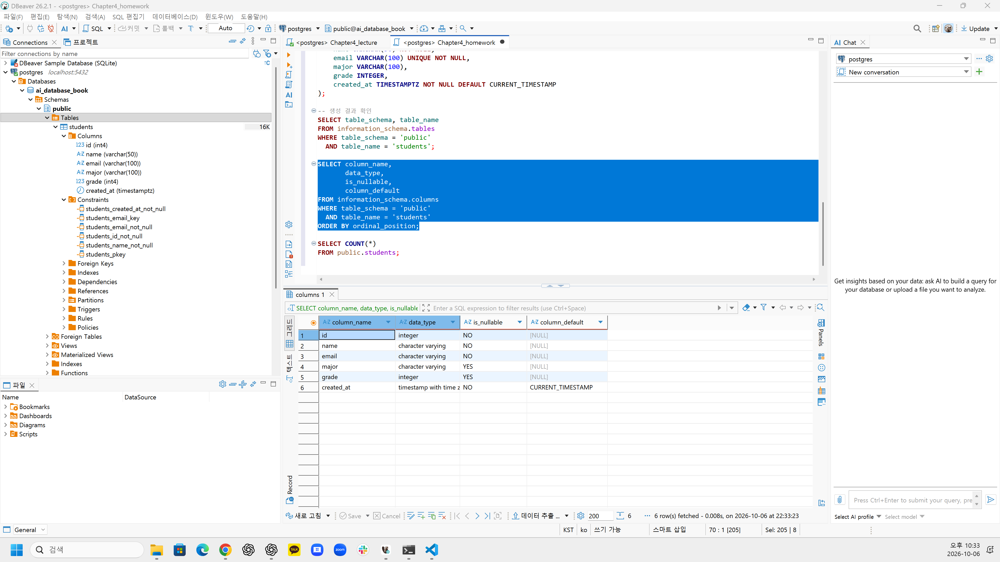
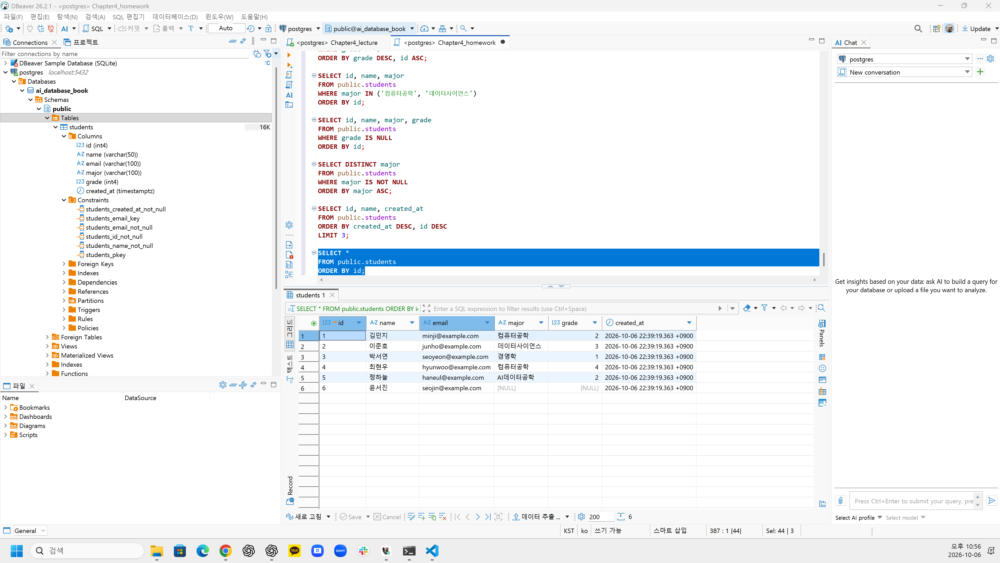
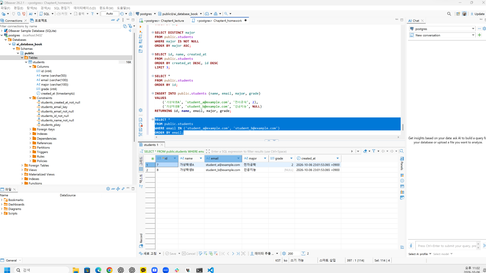
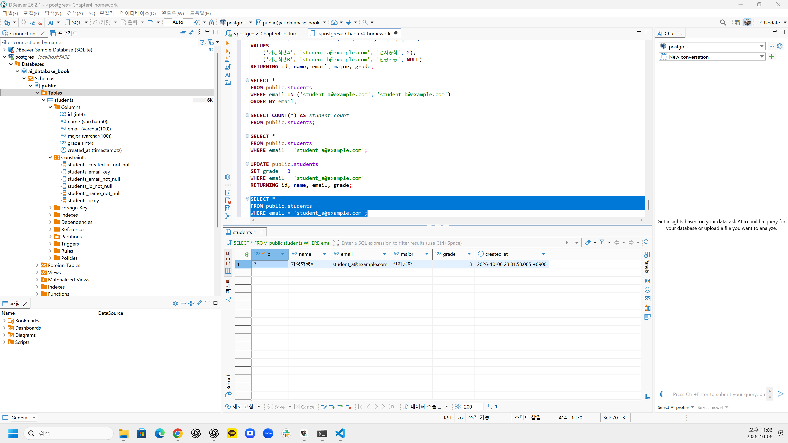
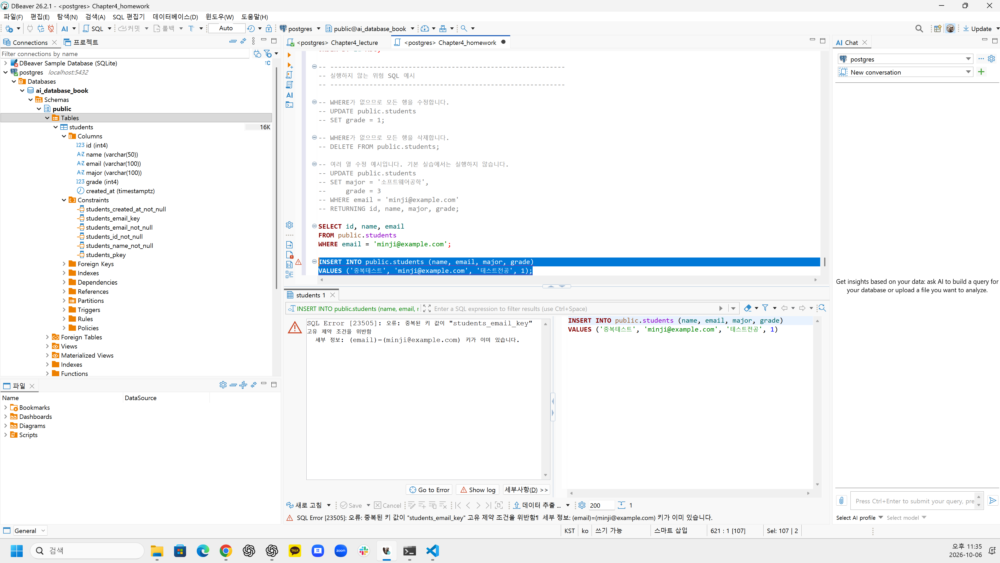
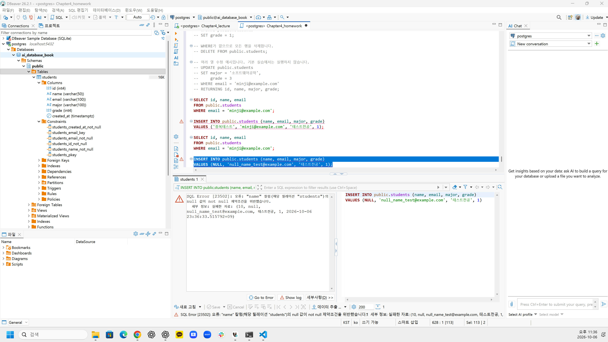

# Chapter 04 확장 실습 답안 템플릿

> **과제:** 관계형 데이터베이스와 SQL 시작하기  
> **사용 방법:** 이 파일을 내려받아 본인의 GitHub 저장소에 `chapter04_answer.md`라는 이름으로 저장한 뒤 실습하면서 바로 작성합니다.  
> **제출 방법:** LMS에는 파일을 직접 업로드하지 않고, **본인 GitHub 저장소의 `chapter04_answer.md` 파일 URL**을 제출합니다.

---

## 제출 전 주의

이 파일과 캡처 화면에는 실제 비밀번호, 전체 DB 접속 URL, API Key, 개인정보를 기록하지 않습니다.

```text
GitHub 계정 또는 별칭:yangguebeom
과제 작성일:2026-10-06
사용한 AI 도구:ChatGPT
```

---

# 1. 실습 환경과 시작 상태 확인

다음을 실행합니다.

```sql
SELECT current_database();
SELECT current_user;
SELECT current_schema();
SHOW search_path;
SHOW transaction_read_only;
```

| 확인 항목 | 실제 결과 | 의미 |
| --- | --- | --- |
| current_database() | ai_database_book | 현재 연결된 데이터베이스 |
| current_user | postgres | 현재 데이터베이스에 접속한 사용자 |
| current_schema() | public | 현재 기본 스키마 |
| search_path | public, "$user" | 객체 이름 검색 시 확인하는 스키마 경로 |
| transaction_read_only | off | 현재 연결이 읽기 전용이 아님 |

- [x] 현재 DB가 `ai_database_book`이다.
- [x] 변경 가능한 연결인지 확인했다.
- [x] 실행할 SQL 범위를 확인했다.
- [x] Auto-commit 상태를 확인했다.

### 변경 SQL을 실행하기 전에 현재 DB와 실행 범위를 확인해야 하는 이유

```text
잘못된 데이터베이스나 의도하지 않은 범위에서 변경 SQL을 실행하면 다른 데이터가 수정되거나 삭제될 수 있으므로, 실행 전에 현재 DB와 실행할 SQL의 범위를 확인해야 한다.
```

---

# 2. `public.students` 구조 생성

## 2-1. 실행 전 예상

```text
테이블 이름: public.students
한 행의 의미: 학생 한 명의 정보
예상 행 수: 0
기본키: id
필수 열: id, name, email, created_at
중복을 막는 열: email
자동 생성 열: id, created_at
```

## 2-2. 실행 파일

```text
code/chapter04/01_create_students.sql
```

## 2-3. 실행 후 확인

```text
테이블 생성 성공 여부: 성공
실제 행 수: 0
DBeaver에서 확인한 위치: Schemas > public > Tables > students
```

### 각 열의 역할

| 열 | 타입 | NULL 가능? | 역할 |
| --- | --- | --- | --- |
| id | INTEGER | 불가 | 각 학생 행을 구분하는 내부 식별자이며 기본키 |
| name | VARCHAR(50) | 불가 | 학생 이름 |
| email | VARCHAR(100) | 불가 | 학생 이메일이며 중복이 허용되지 않음 |
| major | VARCHAR(100) | 가능 | 학생 전공 |
| grade | INTEGER | 가능 | 학생 학년 |
| created_at | TIMESTAMPTZ | 불가 | 행이 생성된 시각 |

### `id`를 학번이나 학생 수로 해석하면 안 되는 이유

```text
id는 실제 학번이나 전체 학생 수를 나타내는 값이 아니라, 각 행을 고유하게 구분하기 위해 데이터베이스가 사용하는 내부 식별자이기 때문이다.
```

### 증거 화면

권장 경로:

```text
assignments/chapter04/images/step02_table.png
```



---

# 3. 샘플 데이터 6명 입력

## 3-1. 실행 전 예상

```text
현재 행 수:0
실행 후 예상 행 수:6
예상되는 NULL 포함 학생:윤서진
```

## 3-2. 실행 파일

```text
code/chapter04/02_insert_students.sql
```

## 3-3. 실제 결과

```text
실제 행 수:6
이준호 grade:3
박서연 존재 여부:존재
윤서진 major: NULL
윤서진 grade: NULL
```

### 예상과 실제 비교

```text
예상과 실제가 일치했는가: 일치함
다르다면 이유: 해당 없음
```

### `created_at` 값이 여러 행에서 같을 수 있는 이유

```text
여러 행을 하나의 트랜잭션에서 입력하면 CURRENT_TIMESTAMP가 같은 트랜잭션 시작 시각을 반환할 수 있으므로 여러 학생의 created_at 값이 같을 수 있다.
```

---

# 4. SELECT 복습과 결과 검증

각 문제는 **SQL 실행 전에 예상 행 수를 먼저 작성**합니다.

| 번호 | 조회 문제 | 예상 행 수 | 실제 행 수 | 일치? | 다르면 이유 |
| ---: | --- | ---: | ---: | --- | --- |
| 1 | 전체 학생 | 6 | 6 | 일치 | 해당 없음 |
| 2 | 이름·이메일만 조회 | 6 | 6 | 일치 | 해당 없음 |
| 3 | 특정 전공 | 2 | 2 | 일치 | 해당 없음 |
| 4 | 특정 학년 이상 | 2 | 2 | 일치 | 해당 없음 |
| 5 | 두 전공 중 하나 | 3 | 3 | 일치 | 해당 없음 |
| 6 | `grade IS NULL` | 1 | 1 | 일치 | 해당 없음 |
| 7 | 전공 `DISTINCT` | 4 | 4 | 일치 | 해당 없음 |
| 8 | 정렬 후 상위 3명 | 3 | 3 | 일치 | 해당 없음 |

## 4-1. 내가 직접 작성한 SQL 2개

```sql
-- SQL 1
SELECT id, name
FROM public.students
WHERE name LIKE '%민%'
ORDER BY id;
```

```text
이 SQL의 한 행 의미: 이름에 '민'이 포함된 학생 한 명
예상 행 수: 1
실제 행 수:1
```

```sql
-- SQL 2
SELECT id, name, grade
FROM public.students
WHERE grade IN (2, 3)
ORDER BY id;
```

```text
이 SQL의 한 행 의미: 학년이 2학년 또는 3학년인 학생 한 명
예상 행 수: 3
실제 행 수:3
```

## 4-2. `= NULL` 대신 `IS NULL`을 사용하는 이유

```text
NULL은 일반적인 값이 아니라 값이 없거나 알 수 없는 상태를 의미하므로 = 연산자로 비교할 수 없다. 따라서 NULL 여부를 확인할 때는 IS NULL을 사용해야 한다.
```

## 4-3. `ORDER BY` 없이 결과 순서를 믿으면 안 되는 이유

```text
ORDER BY를 지정하지 않으면 데이터베이스가 결과 행의 순서를 보장하지 않기 때문에 실행 시점이나 처리 방식에 따라 순서가 달라질 수 있다.
```

## 4-4. `DISTINCT`가 원본 데이터를 삭제하는 기능인가요?

```text
아니다. DISTINCT는 조회 결과에서 중복된 값을 한 번만 표시하는 기능이며 원본 테이블의 데이터는 삭제하거나 변경하지 않는다.
```

### 증거 화면

권장 경로:

```text
assignments/chapter04/images/step04_select.png
```



---

# 5. 내 가상 학생 2명 추가

실명·실제 이메일 대신 가상 데이터를 사용합니다.

## 5-1. 실행 전 계획

```text
학생 A
이름: 가상학생A
이메일: student_a@example.com
전공: 전자공학
학년: 2

학생 B
이름: 가상학생B
이메일: student_b@example.com
전공: 인공지능
학년 또는 NULL: NULL

현재 행 수:6
추가 후 예상 행 수:8
```

## 5-2. 내가 실행한 INSERT

```sql
INSERT INTO public.students (name, email, major, grade)
VALUES
    ('가상학생A', 'student_a@example.com', '전자공학', 2),
    ('가상학생B', 'student_b@example.com', '인공지능', NULL)
RETURNING id, name, email, major, grade;
```

## 5-3. 실제 결과

```text
RETURNING 또는 확인 SELECT 결과: 가상학생A와 가상학생B가 각각 1행씩 정상적으로 조회됨
실제 전체 행 수: 8
예상과 일치 여부: 일치함
```

### 내가 일부 값을 NULL로 둔 이유 또는 NULL을 사용하지 않은 이유

```text
학생 B의 학년 정보가 아직 정해지지 않은 상태를 표현하기 위해 grade를 NULL로 두었다.
```

---

# 6. 안전한 UPDATE

내가 추가한 가상 학생 한 명만 수정합니다.

## 6-1. 먼저 대상 확인 SELECT

```sql
SELECT *
FROM public.students
WHERE email = 'student_a@example.com';
```

```text
예상 대상 행 수: 1
실제 대상 행 수: 1
```

## 6-2. UPDATE

```sql
UPDATE public.students
SET grade = 3
WHERE email = 'student_a@example.com'
RETURNING id, name, email, grade;
```

```text
예상 영향 행 수: 1
실제 영향 행 수: 1
RETURNING 결과: id 7, 가상학생A, student_a@example.com, grade 3
```

## 6-3. UPDATE 후 재조회

```sql
SELECT *
FROM public.students
WHERE email = 'student_a@example.com';
```

### `WHERE` 없는 UPDATE를 실행하면 위험한 이유

```text
WHERE 조건이 없으면 테이블의 모든 행이 수정 대상이 될 수 있으므로, 의도하지 않은 여러 학생의 데이터까지 한꺼번에 변경될 위험이 있다.
```

### 증거 화면

권장 경로:

```text
assignments/chapter04/images/step06_update.png
```





---

# 7. 안전한 DELETE

내가 추가한 가상 학생 한 명을 삭제합니다.

## 7-1. 삭제 전 확인

```sql
SELECT *
FROM public.students
WHERE email = 'student_b@example.com';
```

```text
예상 대상 행 수: 1
실제 대상 행 수: 1
```

## 7-2. DELETE

```sql
DELETE FROM public.students
WHERE email = 'student_b@example.com'
RETURNING id, name, email;
```

```text
예상 영향 행 수: 1
실제 영향 행 수: 1
RETURNING 결과: id 8, 가상학생B, student_b@example.com
```

## 7-3. 삭제 후 재조회

```sql
SELECT *
FROM public.students
WHERE email = 'student_b@example.com';
```

```text
삭제 후 같은 조건의 SELECT 결과 행 수: 0
```

### `DELETE` 성공 메시지만 보고 끝내지 않고 다시 SELECT해야 하는 이유

```text
DELETE 성공 메시지만 보고 끝내지 않고 다시 SELECT해야 하는 이유

DELETE가 실행되었다는 메시지만으로는 의도한 행이 정확히 삭제되었는지 확실히 알기 어려우므로, 같은 WHERE 조건으로 다시 SELECT하여 해당 행이 0행인지 확인해야 한다.
```

---

# 8. 본문 기준 UPDATE·DELETE 상태 검증

`04_update_delete_students.sql`을 본문 시작 상태에서 실행했다면 다음을 확인합니다.

```text
최종 학생 수: 5
이준호 grade: 4
박서연 존재 여부: 0행
```

본문 기준 기대 상태와 비교합니다.

```text
학생 수 = 5
이준호 grade = 4
박서연 = 0행
```

### 내 실제 결과가 기준과 다르다면 원인

```text
해당 없음
```

---

# 9. 의도한 실패 2개 관찰

> 실패 테스트는 데이터베이스 규칙이 실제로 데이터를 보호하는지 확인하는 실험입니다.

## 9-1. 중복 이메일 `UNIQUE` 오류

내가 사용한 SQL:

```sql
INSERT INTO public.students (name, email, major, grade)
VALUES ('중복테스트', 'minji@example.com', '테스트전공', 1);
```

```text
오류 메시지 핵심 단서: 중복된 키 값, students_email_key, email=(minji@example.com)
왜 실패해야 맞는가: 이미 존재하는 minji@example.com 이메일을 다시 입력했기 때문이다.
어떤 규칙이 작동했는가: email 열의 UNIQUE 제약조건
실패 후 기존 데이터가 어떻게 유지되었는가: 중복 행은 추가되지 않았고 기존 김민지 데이터 1행은 그대로 유지되었다.
```

## 9-2. 이름 `NULL` 입력 `NOT NULL` 오류

내가 사용한 SQL:

```sql
INSERT INTO public.students (name, email, major, grade)
VALUES (NULL, 'null_name_test@example.com', '테스트전공', 1);
```

```text
오류 메시지 핵심 단서: name 컬럼의 null 값, not-null 제약조건 위반
왜 실패해야 맞는가: name 열은 NULL을 허용하지 않는데 NULL을 입력했기 때문이다.
어떤 규칙이 작동했는가: name 열의 NOT NULL 제약조건
```

### 실패한 INSERT 뒤 자동 생성 `id` 번호에 빈 구간이 생길 수 있어도 문제라고 단정할 수 없는 이유

```text
실패한 INSERT에서도 자동 생성용 id 값이 먼저 소비될 수 있으므로 id 번호에 빈 구간이 생길 수 있다. id는 행을 구분하기 위한 내부 식별자이므로 번호가 연속되지 않는 것 자체는 데이터 오류라고 볼 수 없다.
```

### 증거 화면

권장 경로:

```text
assignments/chapter04/images/step09_constraint_error.png
```





---

# 10. `verify_students.sql`로 최종 상태 확인

실행 파일:

```text
code/chapter04/verify_students.sql
```

```text
현재 전체 학생 수: 5
NULL 개수: major 1개, grade 1개
이준호 grade: 4
박서연 존재 여부: false
현재 데이터 상태에서 예상과 다른 부분: 없음
```

### 검증 SQL을 따로 두면 좋은 이유

```text
실습 SQL이 오류 없이 실행되었다는 것만으로는 최종 데이터가 기대한 상태와 일치한다고 보장할 수 없기 때문이다. 검증 SQL을 따로 두면 테이블 구조, 전체 행 수, NULL 상태, 특정 학생의 수정·삭제 결과 등을 다시 확인하여 최종 상태가 기준과 일치하는지 검증할 수 있다.
```

---

# 11. AI를 SQL 작성자가 아니라 검토자로 활용

먼저 본인이 SQL을 작성한 뒤 AI에게 검토를 요청합니다.

## 11-1. 내가 작성한 SQL

```sql
UPDATE public.students
SET grade = 3
WHERE email = 'minji@example.com';
```

## 11-2. AI에게 전달한 핵심 요청

```text
나는 PostgreSQL 초보자입니다.
아래 SQL을 바로 다시 작성하지 말고 먼저 안전성을 검토해 주세요.

1. 이 SQL이 영향을 줄 것으로 예상되는 행
2. WHERE 조건이 너무 넓거나 모호하지 않은지
3. NULL 처리에서 주의할 점
4. 실행 전에 같은 조건으로 확인할 SELECT
5. 실행 후 결과를 확인할 SELECT
6. 내가 놓친 위험이 있다면 질문 형태로 제시

[내 SQL]

UPDATE public.students
SET grade = 3
WHERE email = 'minji@example.com';
```

## 11-3. AI 검토 결과

| AI 제안 | 수용 / 수정 / 거절 | 실제 검증 결과 | 나의 이유 |
| --- | --- | --- | --- |
| 실행 전에 같은 WHERE 조건으로 SELECT하여 대상 행을 확인한다. | 수용 | `minji@example.com`은 김민지 1행에 해당함 | UPDATE 전에 실제 대상이 의도한 학생인지 확인하는 것이 안전하기 때문이다. |
| UPDATE에 RETURNING을 추가하여 수정된 행을 바로 확인한다. | 수용 | `email`은 UNIQUE이므로 예상 영향 행 수는 1행임 | 수정된 행과 변경된 `grade` 값을 즉시 확인할 수 있기 때문이다. |
| WHERE 조건을 `name`으로 바꾸어도 된다. | 거절 | `email`에는 UNIQUE 제약조건이 있지만 `name`에는 UNIQUE 제약조건이 없음 | 같은 이름을 가진 학생이 존재할 수 있으므로 `email` 조건이 더 안전하기 때문이다. |

### AI가 예상한 영향 행 수와 실제 결과가 같았나요?

```text
같았다. email은 UNIQUE 제약조건이 있는 열이고 minji@example.com에 해당하는 학생은 김민지 1명이므로 예상 영향 행 수는 1행이다.
```

### AI 답변을 실행 전에 검토해야 하는 이유

```text
AI의 답변이 문법적으로 올바르더라도 실제 데이터 상태와 WHERE 조건에 따라 예상보다 많은 행이 수정되거나 삭제될 수 있기 때문이다. 따라서 AI의 제안을 그대로 실행하지 않고 먼저 SELECT로 대상 행을 확인하고, 제안이 현재 데이터와 과제 목적에 맞는지 검토해야 한다.
```

---

# 12. 내 서비스 테이블 하나 확장 설계

Chapter 01~03에서 정한 개인 서비스에서 **테이블 하나**를 선택합니다.

```text
서비스 이름: 스터디 모임 관리 서비스
테이블 이름: study_applications
한 행의 의미: 한 회원이 한 스터디에 제출한 참여 신청 1건
```

| 열 이름 | 저장할 값 | 타입 후보 | NULL 가능? | UNIQUE 후보? | 이유 |
| --- | --- | --- | --- | --- | --- |
| id | 참여 신청의 내부 식별 번호 | INTEGER | 불가 | 예 | 각 참여 신청 행을 서로 구분하기 위한 기본 식별자이기 때문이다. |
| study_id | 신청 대상 스터디의 식별 번호 | INTEGER | 불가 | 단독으로는 아니오 | 하나의 스터디에 여러 회원이 신청할 수 있기 때문이다. |
| member_id | 신청한 회원의 식별 번호 | INTEGER | 불가 | 단독으로는 아니오 | 한 회원이 여러 스터디에 신청할 수 있기 때문이다. |
| status | 신청 상태(대기, 승인, 거절 등) | VARCHAR(20) | 불가 | 아니오 | 여러 신청이 같은 상태 값을 가질 수 있기 때문이다. |
| applied_at | 참여 신청 시각 | TIMESTAMPTZ | 불가 | 아니오 | 여러 신청이 같은 시각에 발생할 가능성이 있으므로 고유값일 필요가 없다. |
| decided_at | 승인 또는 거절이 결정된 시각 | TIMESTAMPTZ | 가능 | 아니오 | 아직 처리되지 않은 신청은 결정 시각이 존재하지 않을 수 있기 때문이다. |
| note | 신청자가 남기는 추가 내용 | VARCHAR(500) | 가능 | 아니오 | 추가 내용은 선택 사항이며 서로 같은 내용이 입력될 수도 있기 때문이다. |

```text
PK 후보: id
업무 식별자 후보: study_id와 member_id의 조합
아직 미확정인 규칙: 같은 회원이 같은 스터디에 다시 신청할 수 있는지 여부와, 재신청을 허용하지 않을 경우 study_id와 member_id 조합에 UNIQUE를 적용할지는 확인 필요
```

## 선택: CREATE TABLE 초안

> 아직 확정되지 않은 업무 규칙은 억지로 제약조건으로 만들지 않습니다.

```sql
CREATE TABLE study_applications (
    id INTEGER GENERATED BY DEFAULT AS IDENTITY PRIMARY KEY,
    study_id INTEGER NOT NULL,
    member_id INTEGER NOT NULL,
    status VARCHAR(20) NOT NULL,
    applied_at TIMESTAMPTZ NOT NULL DEFAULT CURRENT_TIMESTAMP,
    decided_at TIMESTAMPTZ,
    note VARCHAR(500)
);
```

### AI에게 검토받은 뒤 수정한 부분

```text
study_id와 member_id의 조합을 바로 UNIQUE 제약조건으로 지정하지 않았다. 같은 회원이 같은 스터디에 재신청할 수 있는지는 아직 확정되지 않은 업무 규칙이기 때문이다. 또한 결정 전에는 decided_at 값이 존재하지 않을 수 있으므로 NULL을 허용했고, 신청 시각인 applied_at은 값을 생략해도 현재 시각이 자동으로 저장되도록 기본값을 두었다.
```

---

# 13. 최종 성찰

아래 문장은 본인의 말로 작성합니다.

```text
1. SQL 실행 성공과 올바른 대상 선택이 다른 이유는
   SQL 문법이 맞아 정상 실행되더라도 WHERE 조건이 잘못되면 의도하지 않은 행까지 수정하거나 삭제할 수 있기 때문이다.

2. UPDATE와 DELETE 전에 SELECT를 먼저 해야 하는 이유는
   같은 WHERE 조건으로 실제 대상 행을 미리 확인하여 의도한 데이터만 변경되는지 검증할 수 있기 때문이다.

3. 영향받은 행 수를 확인해야 하는 이유는
   예상한 행 수와 실제 변경된 행 수가 같은지 비교하여 잘못된 조건이나 예상하지 못한 데이터 변경을 발견할 수 있기 때문이다.

4. UNIQUE 또는 NOT NULL 오류를 '보호 장치가 정상 동작한 결과'라고 볼 수 있는 이유는
   중복되면 안 되는 값이나 반드시 입력해야 하는 값에 대해 데이터베이스가 잘못된 입력을 저장하지 못하도록 차단했기 때문이다.

5. AI가 SQL을 만들어 주더라도 내가 반드시 확인해야 하는 것은
   WHERE 조건이 올바른지, 예상 영향 행 수가 적절한지, 현재 데이터 상태와 제약조건에 맞는 SQL인지 직접 검토하는 것이다.
```

---

# 14. 제출 체크리스트

- [x] `chapter04_answer.md`를 본인 저장소에 만들었다.
- [x] 현재 DB와 실행 환경을 확인했다.
- [x] `public.students`를 생성했다.
- [x] 샘플 6명 입력 결과를 검증했다.
- [x] SELECT 문제에서 실행 전 예상 행 수를 작성했다.
- [x] 가상 학생 2명을 추가했다.
- [x] UPDATE 전후를 SELECT로 확인했다.
- [x] DELETE 전후를 SELECT로 확인했다.
- [x] UNIQUE 오류를 관찰했다.
- [x] NOT NULL 오류를 관찰했다.
- [x] `verify_students.sql`로 상태를 확인했다.
- [x] AI 제안을 실제 SQL 결과와 비교했다.
- [x] 개인 서비스 테이블 하나를 확장 설계했다.
- [x] 핵심 캡처는 3~4장 정도로 제한했다.
- [x] 비밀번호·개인정보가 캡처에 없다.
- [x] Markdown 이미지가 GitHub 웹 화면에서 정상 표시된다.
- [x] commit/push를 완료했다.

---

# 15. LMS 제출 URL

아래 형식의 **본인 GitHub 파일 URL**을 LMS에 제출합니다.

```text
https://github.com/<본인-GitHub-ID>/<본인-저장소>/blob/main/assignments/chapter04/chapter04_answer.md
```

내 제출 URL:

```text
https://github.com/yangguebeom/snu-database-2026-2/blob/main/assignments/chapter04/chapter04_answer.md
```

> 교수자 템플릿 URL이나 저장소 메인 URL이 아니라 **작성 완료된 본인 `chapter04_answer.md` 파일 화면 URL**을 제출합니다.
